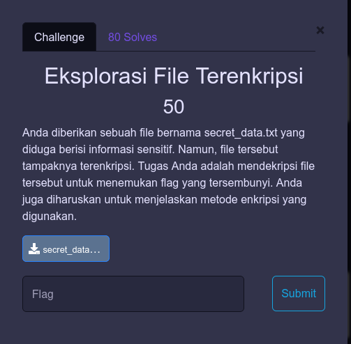
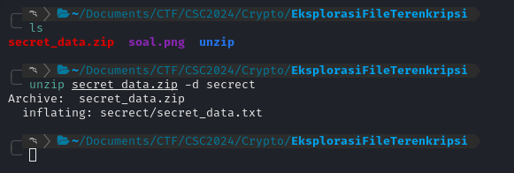
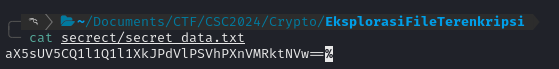
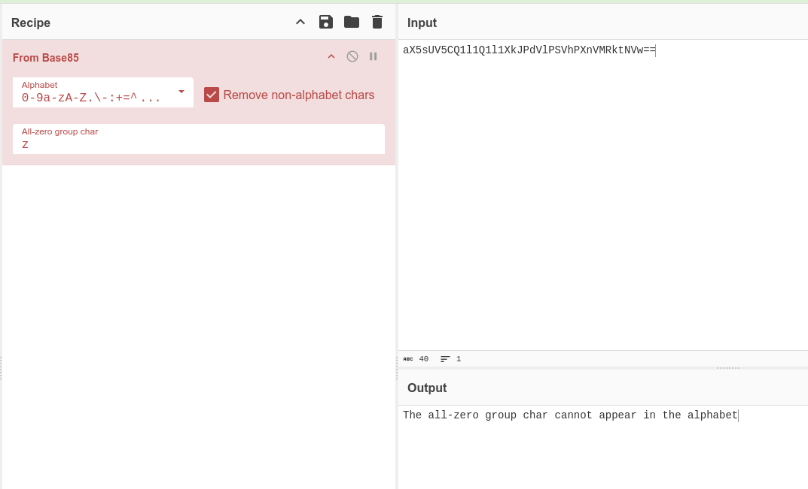
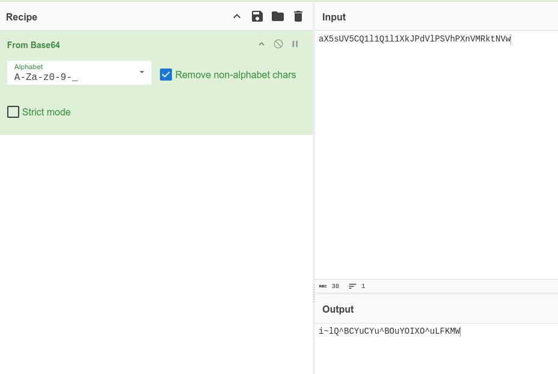
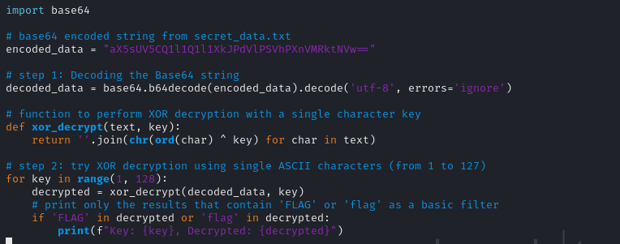
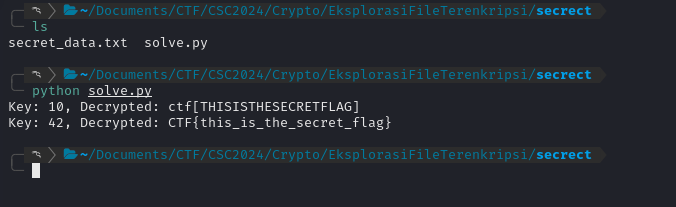

+++
date = '2024-10-12T16:54:04+07:00'
draft = false
title = '[Cyber Strike Competition 1.0 CTF 2024] - Crypto'
categories = [
    "Cryptography",
    "CTF Writeup"
]
image = "image-39.png"
+++

**Cyber Strike Competition 1.0**


# Crypto

## Eksplorasi File Terenkripsi



### Deskripsi Soal

Pada soal ini, deskripsi menyebutkan bahwa dalam file zip "secret_data.zip" terdapat file bernama "secret_data.txt" yang berisi informasi sensitif, yaitu flag. Deskripsi juga memberikan petunjuk bahwa untuk menyelesaikan soal ini, kita perlu mendekripsi teks terenkripsi dalam file "secret_data.txt".

### Analisis dan Pemecahan Masalah

Saya memulai dengan mengekstrak file "secret_data.zip" dan menyimpannya ke dalam folder 'secret'.



Setelah diekstrak, saya menemukan file "secret_data.txt" sesuai dengan deskripsi soal. Berikut adalah isi dari file tersebut:



```
aX5sUV5CQ1l1Q1l1XkJPdVlPSVhPXnVMRktNVw==
```

Isi dari "secret_data.txt" terlihat seperti hasil enkripsi Base64. Namun, ketika saya mencoba mendekodenya menggunakan CyberChef ([https://gchq.github.io/CyberChef/](https://gchq.github.io/CyberChef/)) dengan fitur "Magic", hasilnya tidak sesuai harapan.



CyberChef awalnya mendeteksi sebagai Base85. Kemudian, saya mencoba menghapus bagian "==" dan mendekode dengan fitur "Magic" dari CyberChef. Hasilnya adalah:



```
i~lQ^BCYuCYu^BOuYOIXO^uLFKMW
```

Hasil ini masih tampak acak dan menunjukkan bahwa teks tersebut mungkin masih terenkripsi. Kemungkinan metode enkripsi yang digunakan perlu diidentifikasi lebih lanjut, misalnya Caesar cipher, XOR cipher, dan lain-lain.

Untuk langkah selanjutnya, saya mencoba menggunakan XOR Cipher. Saya melakukan _brute-force_ XOR dengan asumsi bahwa kunci mungkin hanya terdiri dari satu karakter ASCII.

Berikut adalah program `solve.py` yang saya gunakan:



Saya langsung menjalankan program `solve.py`.



Hasil dari _brute-force_ XOR menunjukkan dua kunci, yaitu "10" dan "42", yang berhasil mengubah teks menjadi _plaintext_. Namun, ketika saya mencoba mengirimkan flag yang dihasilkan, ternyata flag yang benar adalah `CTF{this_is_the_secret_flag}`.

### Solusi

**Flag:** `CTF{this_is_the_secret_flag}`
