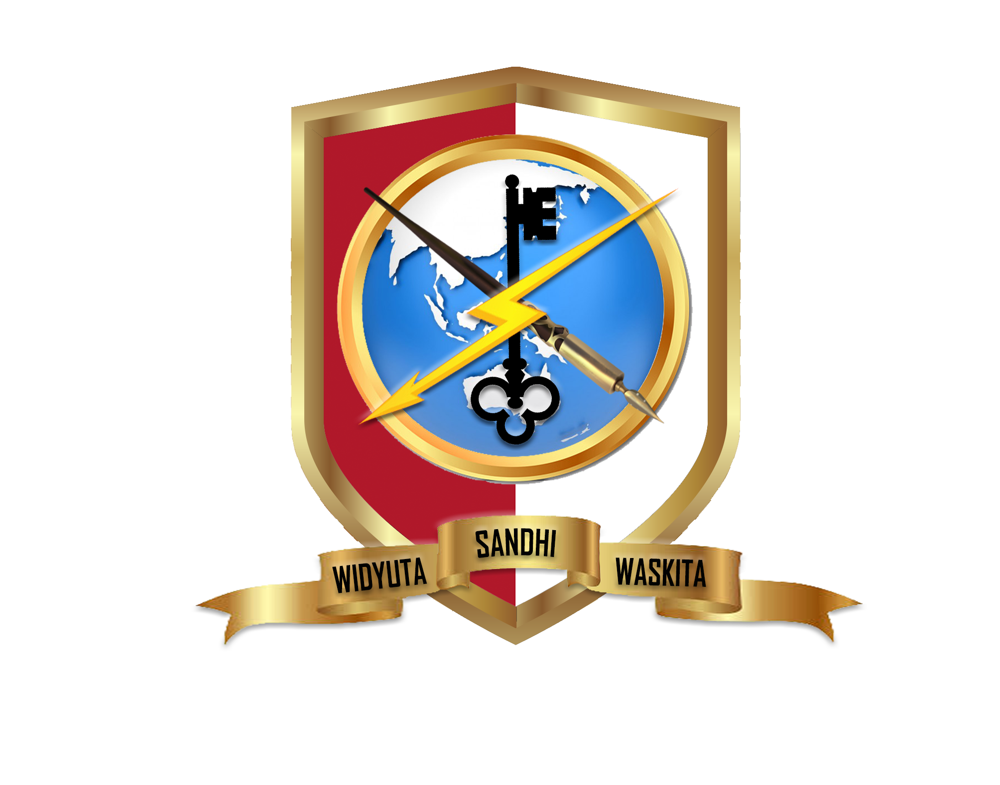
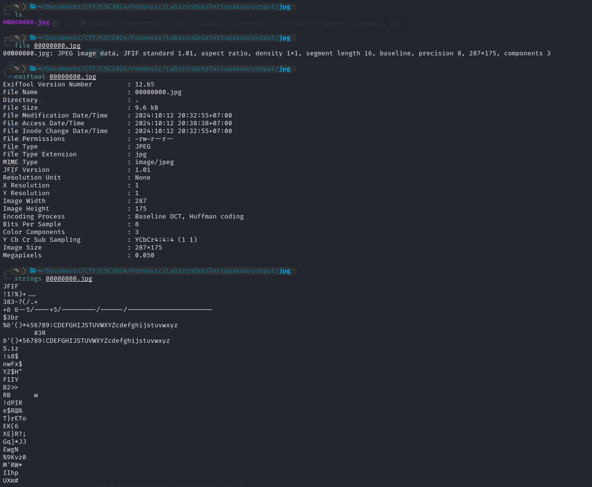

+++
date = '2024-10-12T16:54:04+07:00'
draft = false
title = '[Cyber Strike Competition 1.0 CTF 2024] - Forensic'
categories = [
    "Forensic",
    "CTF Writeup"
]
image = "image-21.png"
+++

# Writeup Forensic CTF



## Log yang Tersembunyi

### Deskripsi Soal

Pada soal ini, saya diberikan sebuah file zip yang berisi sebuah petunjuk tersembunyi.


### Analisis dan Pemecahan Masalah

Untuk menyelesaikan soal ini, langkah pertama yang saya lakukan adalah mengekstrak file zip tersebut dan menyimpannya ke dalam folder "forensic".


Setelah diekstrak, ternyata hanya ada satu file, yaitu "important.txt".


Namun, setelah saya periksa, isi dari file "important.txt" tidak memberikan informasi apapun. Karena tidak ada file lain, saya mencoba melakukan pengecekan pada file zip itu sendiri menggunakan "xxd".


Ternyata, di dalam file zip tersebut terdapat sebuah flag!


### Solusi

**Flag:** `CTF{askdjaskjd123280912}`

## Mystery in the Files

### Deskripsi Soal

Pada soal ini, saya diberikan sebuah file `barangbukti.zip` yang berisi banyak subfolder dan file teks sesuai dengan deskripsi soal.


### Analisis dan Pemecahan Masalah

Setelah mengekstrak file `barangbukti.zip`, saya menemukan banyak subfolder dan file teks.


Jika saya periksa satu per satu, tentu akan memakan waktu. Oleh karena itu, saya memutuskan untuk mencari kata "CTF" pada setiap file txt dengan bantuan "grep".


Namun, hasilnya nihil. Tidak ada kata "CTF{" yang ditemukan.

Kemudian, saya mencoba mencari dengan kata "FLAG".


Hasilnya, saya menemukan sebuah flag, yaitu "FLAG{Forensic_Expert_123}". Karena format flag yang diminta adalah CTF{}, maka flag yang benar adalah CTF{Forensic_Expert_123}.

### Solusi

**Flag:** `CTF{Forensic_Expert_123}`

## Labirin Data Terlupakan

### Deskripsi Soal

Pada soal ini, saya diberikan sebuah file zip yang berisi banyak subfolder dan file txt di setiap subfoldernya.


### Analisis dan Pemecahan Masalah

Setelah mengekstrak file zip tersebut, saya menemukan struktur folder yang kompleks.


Saya mencoba mencari kata "flag" dan "CTF{" dengan grep, tetapi hasilnya tetap tidak ditemukan.


Kemudian, saya mencoba mengikuti steg-check dari [https://book.hacktricks.xyz/crypto-and-stego/stego-tricks](https://book.hacktricks.xyz/crypto-and-stego/stego-tricks), terutama fokus pada penggunaan foremost.


Saya langsung mencoba menggunakan foremost.


Pada tampilan hasil foremost, tidak ada informasi yang menarik. Namun, saya menemukan adanya folder output.


Di dalam folder output, ternyata ada folder "jpg". Ini menandakan bahwa di dalam zip tadi terdapat file jpg. Berikut adalah isi dari file `audit.txt` yang dihasilkan oleh foremost.


Setelah itu, saya langsung mengecek file jpg tersebut.

Jika dibuka, gambar jpg tersebut hanya menampilkan gambar doraemon.


Kemudian, saya mulai mencoba melakukan stegano check, seperti menggunakan `file`, `exiftool`, dan `strings`.



Pada bagian awal string, saya menemukan pola seperti ini:

```
*456789:CDEFGHIJSTUVWXYZcdefghijstuvwxyz
*56789:CDEFGHIJSTUVWXYZcdefghijstuvwxyz
```

Saya menduga ini adalah bagian key yang mungkin berguna untuk langkah selanjutnya.

Karena dari percobaan tadi tidak ada informasi yang menarik, saya mencoba menggunakan steghide.


Namun, ternyata steghide meminta password.

Saya mencoba menggunakan key yang saya temukan sebelumnya, tetapi tidak berhasil.

Oleh karena itu, saya perlu mencari password untuk membuka isi dari gambar tersebut. Untuk mencari password/passphrase, saya menggunakan tools StegCracker ([https://github.com/Paradoxis/StegCracker](https://github.com/Paradoxis/StegCracker)) untuk melakukan _brute force_ passphrase.


Secara otomatis, StegCracker akan menggunakan wordlist dari `rockyou.txt` yang tersimpan di PC. Saya langsung menjalankan StegCracker.


Setelah beberapa saat, saya berhasil menemukan password untuk gambar tersebut, yaitu "password123". Sekarang, saya mencoba lagi steghide dengan password/passphrase "password123".


Ternyata, di dalam gambar tersebut masih ada file txt lagi. Sekarang, saya akan mengecek file txt tersebut.


Akhirnya, saya menemukan flag-nya!

### Solusi

**Flag:** `CTF{labirin_disini}`

## Tersembunyi

### Deskripsi Soal

Pada soal kali ini, saya ditugaskan untuk mencari flag di dalam file zip.


### Analisis dan Pemecahan Masalah

Saya langsung mengekstrak file zip tersebut.


Dari hasil ekstraksi, terdapat dua file txt. Berikut adalah isi dari masing-masing file txt.


Ada sesuatu yang menarik pada file `secret_message.txt`.

Pada bagian "pesan penting", terdapat kode biner. Saya mencoba mendekode kode biner ini menggunakan web [https://cryptii.com/pipes/binary-decoder](https://cryptii.com/pipes/binary-decoder), tetapi hasilnya tidak bisa didekode.


Kemudian, saya menggunakan web favorit saya, yaitu CyberChef, untuk menggunakan fitur "Magic" yang secara otomatis dapat mendeteksi encoding yang digunakan.


Hasilnya, encoding yang digunakan adalah "UNIX Timestamp", dan hasilnya berupa tanggal:

`Mon 14 January 2002 12:08:21.100 UTC`

Selanjutnya, saya mencoba mendekode bagian "Flag terenkripsi: Q1RGezEyM1NyeXB0b30=". Saya masih menggunakan CyberChef.


Hasilnya menampilkan flag!

### Solusi

**Flag:** `CTF{123Srypto}`
