+++
date = '2024-10-12T16:54:04+07:00'
draft = false
title = '[Cyber Strike Competition 1.0 CTF 2024] - Reverse'
categories = [
    "Reverse",
    "CTF Writeup"
]
image = "image-63.png"
+++

Reverse Engineering

Pada soal-soal reverse engineering ini, disini ada ‘celah’ pada setiap soal nya. Celah yang dimaksud yaitu untuk mendapatkan flag nya tanpa harus secara ‘reverse’, jadi cukup dengan melihat isi file nya, dan akan muncul flag nya tanpa harus di reverse engineering. Jadi setiap soal yang saya lakukan untuk mendapatkan flag nya menggunakan cara yang sama.

Sayangnya pada writeup ini dibuat, saya tidak cukup waktu untuk melakukan screenshoot setiap soal-soalnya.

## Mystery Dungeon

Oke langsung saya disini saya mengecek isi file nya dengan “cat mystery_dungeon”

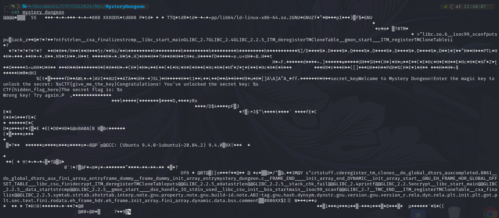

Dari hasil tersebut, sebenarnya sudah keliatan flag nya, tetapi disini saya pake strings dan grep agar lebih jelas flag nya

strings mystery_dungeon | grep "CTF{"

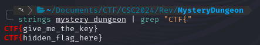

Dari hasil tersebut, terdapat 2 flag. Tetapi kemungkinan key untuk mendapatkan dari program tersebut yaitu “CTF{give_me_the_key}”. Tetapi untuk memastikan nya, saya coba jalankan program nya

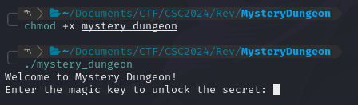

Lalu masukan key nya CTF{give_me_the_key}

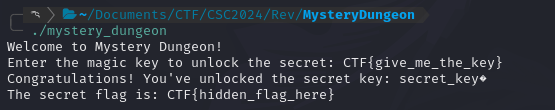

Maka flag nya CTF{hidden_flag_here}

flag: CTF{hidden_flag_here}

## Quantum

Pada soal ini, terdapat 2 file yaitu “key.txt” “quantum_crypt”

isi key.txt

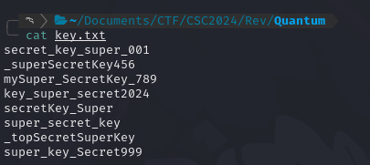

isi quantum_crypt

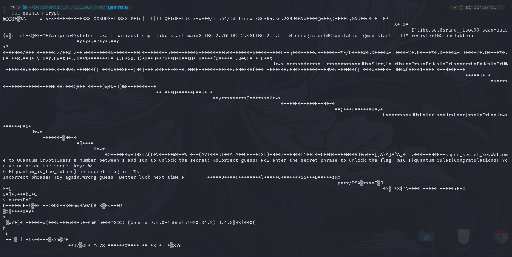

Dari melihat isi file nya, terlihat isi flag nya. Akan tetapi disini saya coba cek lagi dengan strings dan grep

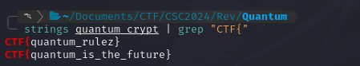

CTF{quantum_rulez}

CTF{quantum_is_the_future}

Untuk memastikan nya, disini saya coba jalankan programnya

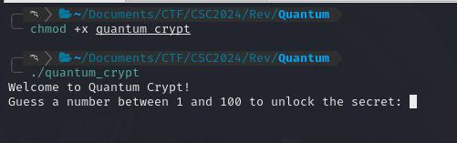

Karna tidak tau nomor berapa untuk membuka secret key nya, disini saya langsung coba melihat flow nya dengan ida64

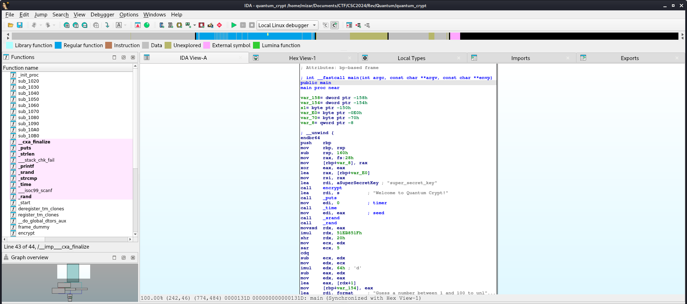

Setelah itu scroll kebawah, dan akan terlihat flow nya

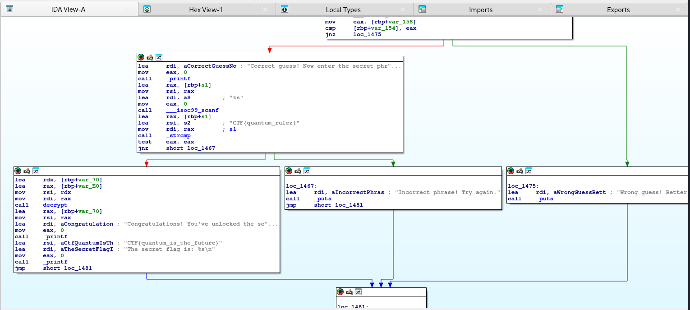

Dari flow tersebut, ketika berhasil menemukan nomor nya, maka secret phrase nya yaitu CTF{quantum_rulez}. Dan setelah itu ketika memasukan phrase untuk membuka flag nya, maka flag nya adalah CTF{quantum_is_the_future}.

Flag: CTF{quantum_is_the_future}

## Simple Check

Pada soal ini, hanya ada satu file, yaitu simple_check. Ketika saya coba jalankan, program akan meminta inputan password

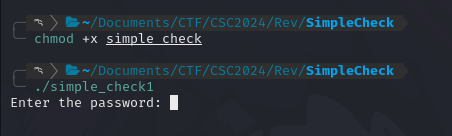

Karna chall ini ada ‘celah’ buat mendapatkan flag nya, jadi cukup menggunakan strings dan grep saja

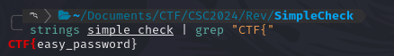

Yups flag nya ada satu saja

flag: CTF{easy_password}

## Encrypted Flag

Pada soal ini terdapat sebuah file encrypted_flag. Untuk mendapatkan flag nya sama seperti cara yang sebelumnya, yaitu mencoba menjalakan program nya terlebih dahulu

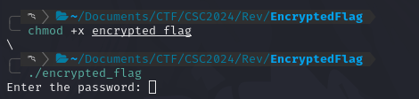

Karna program nya meminta password, jadi disini saya mencoba mencari flag dengan strings dan grep saja

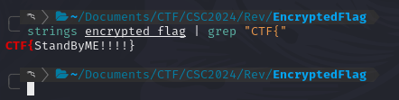

CTF{StandByME!!!!}

Untuk memastikan nya, saya mencoba menjalankan lgi dan memasukan password tadi

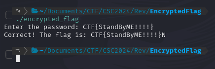

Yups hasilnya benar

flag: CTF{StandByME!!!!}

# Terima kasih

CTF Cyber Strike Competition 1.0

Meskipun masih banyak kekurangan dari beberapa soal yang diberikan nya, tapi masih ada beberapa soal lagi yang menarik dan menambah ilmu bagi saya sendiri.

Mungkin untuk soal kategori reverse tidak segampang itu untuk mendapatkan flag nya, akan tetapi soal-soal yang diberikan nya bagi saya menarik untuk bahan belajar revese engineering untuk mendapatkan flag nya sesungguh nya.

Sekali lagi, Terima kasih :D
