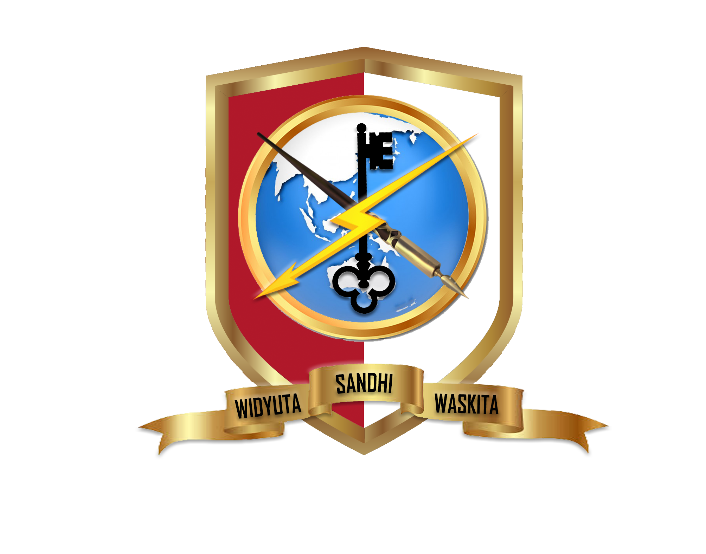
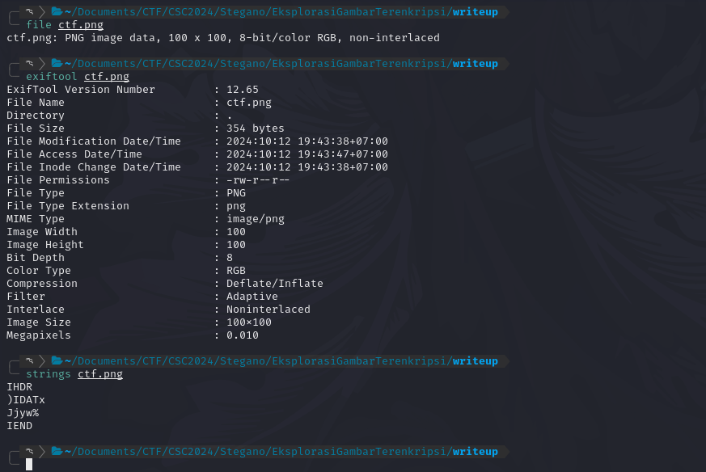
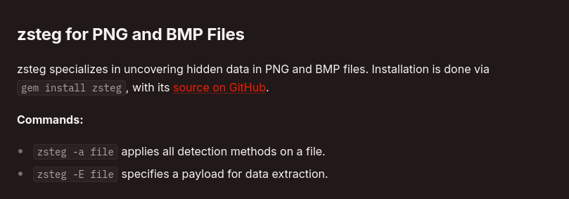
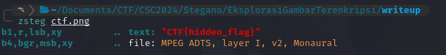

+++
date = '2024-10-12T16:54:04+07:00'
draft = false
title = '[Cyber Strike Competition 1.0 CTF 2024] - Stegano'
categories = [
    "Stegano",
    "CTF Writeup"
]
image = "image-43.png"
+++

# Stegano

## Eksplorasi Gambar Terenkripsi

Pada write up ini dibuat, sayangnya kondisi event ctf pada website nya sudah tutup, sehingga saya lupa untuk melakukan screenshoot soal nya.

Intinya pada soal kali ini, terdapat sebuah file gambar .png. Untuk mendapatkan flag nya perlu mencari di dalam gambar tersebut. Tampilan dari ctf.png ini hanya berupa tampilan warna putih seperti dibawah berikut:

Disini hal yang saya lakukan yaitu mengecek informasi pada gambar tersebut, seperti ‘file’, ‘exiftool’, dan ‘strings’.

Dari hasil informasi, sebenarnya tidak ada yang menarik. Tetapi dari informasi tersebut bahwa file ctf.png ini memang benar format PNG.

Lalu saya mencoba mengikuti metode dari stegano-tricks https://book.hacktricks.xyz/crypto-and-stego/stego-tricks

Fokus pada bagian zsteg, karna format file ini yaitu png.

Hasil dari zsteg, dapat menampilkan sebuah flag

flag: CTF{hidden_flag}
