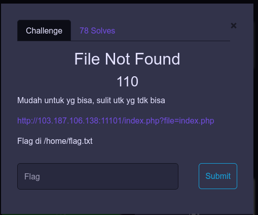
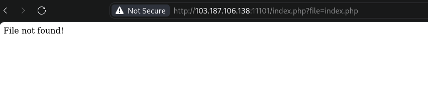
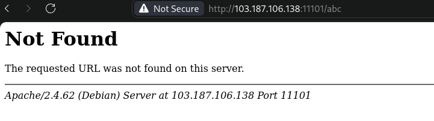
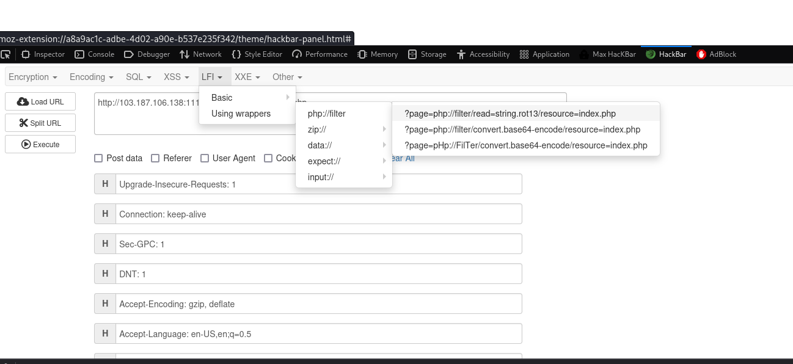
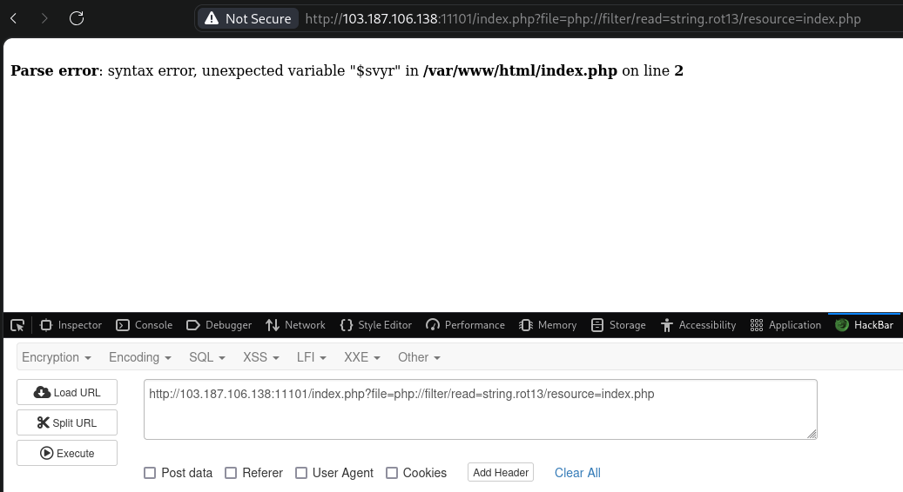
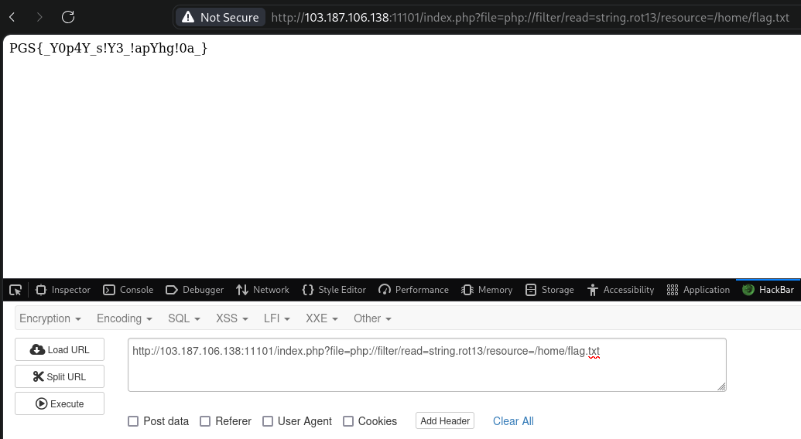
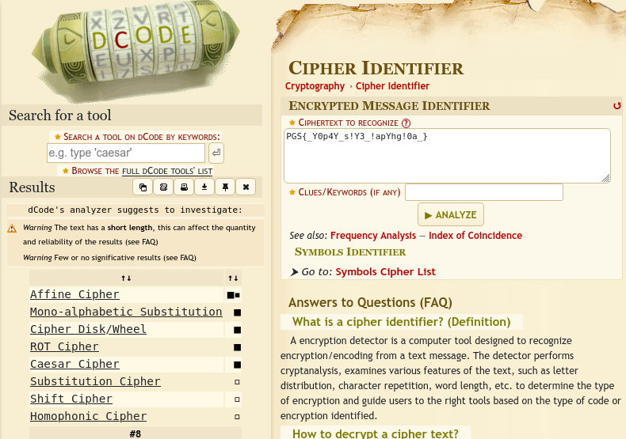
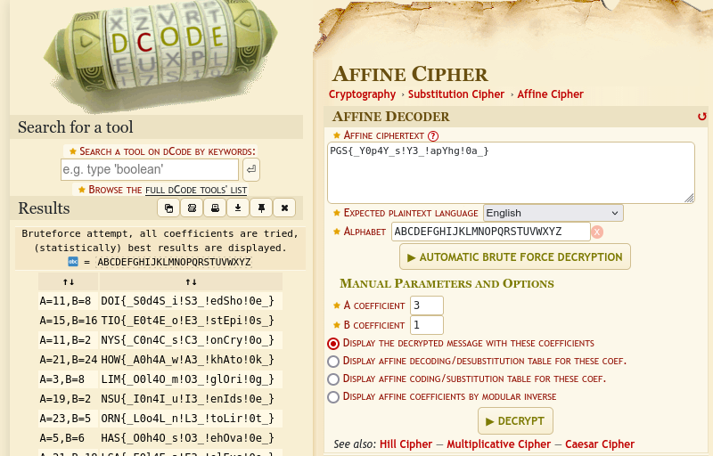
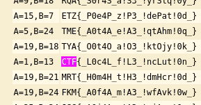

+++
date = '2024-10-12T16:54:04+07:00'
draft = false
title = '[Cyber Strike Competition 1.0 CTF 2024] - Web'
categories = [
    "Web",
    "CTF Writeup"
]
image = "image-50.png"
+++

# Web-Exploit

## File Not Found

Pada soal ini, hanya ada link web target dan juga hint untuk path flag nya.

Ketika saya akses web nya, tampilan nya seperti ini:

Terlihat ada informasi bahwa file tidak ada “file not found”. Tetapi ketika saya ubah parameter nya menjadi /abc, maka tampilan error seperti ini:

Berarti file index.php tadi hanya berisi “fake not found”.

Selain itu pada url target, terlihat seperti vulnerability terhadap local file inclusion”index.php?file=index.php”

Oke disini saya mencoba LFI menggunakan ektension Hackbar, pilih LFI-&gt;Using wrapper-&gt;php://filter

page=php://filter/read=string.rot13/resource=index.php

pada bagian “page=” diubah menjadi “file=”, sehingga lengkap nya seperti ini

http://103.187.106.138:11101/index.php?file=php://filter/read=string.rot13/resource=index.php

Setelah di eksekusi, ada tampilan error seperti berikut

Terlihat juga file path website tersebut, disini saya langsung coba memanggil index.php nya sesuai deksripsi soal “/home/flag.txt”

http://103.187.106.138:11101/index.php?file=php://filter/read=string.rot13/resource=/home/flag.txt

Muncul flag nya PGS{_Y0p4Y_s!Y3_!apYhg!0a\_} , tetapi ini masih belum terbaca flag aslinya. jadi perlu tahapan nya lagi. Selanjutnya disini saya cek cipher flag nya menggunakan web https://www.dcode.fr/cipher-identifier

Hasil dari cipher identifier, bahwa kemungkinan flag tersebut menggunakan affine cipher.

selanjutnya disini saya coba decode dengan affine cipher https://www.dcode.fr/affine-cipher

Sekarang coba scroll ke bawah, dan ada flag nya

flag: CTF{_L0c4L_f!L3_!ncLut!0n\_}
