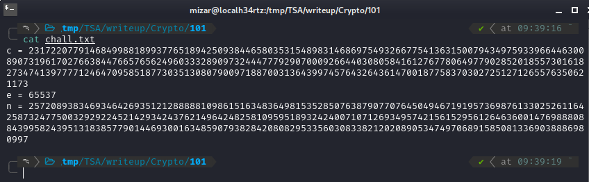
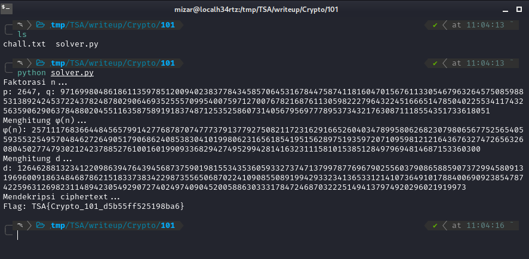
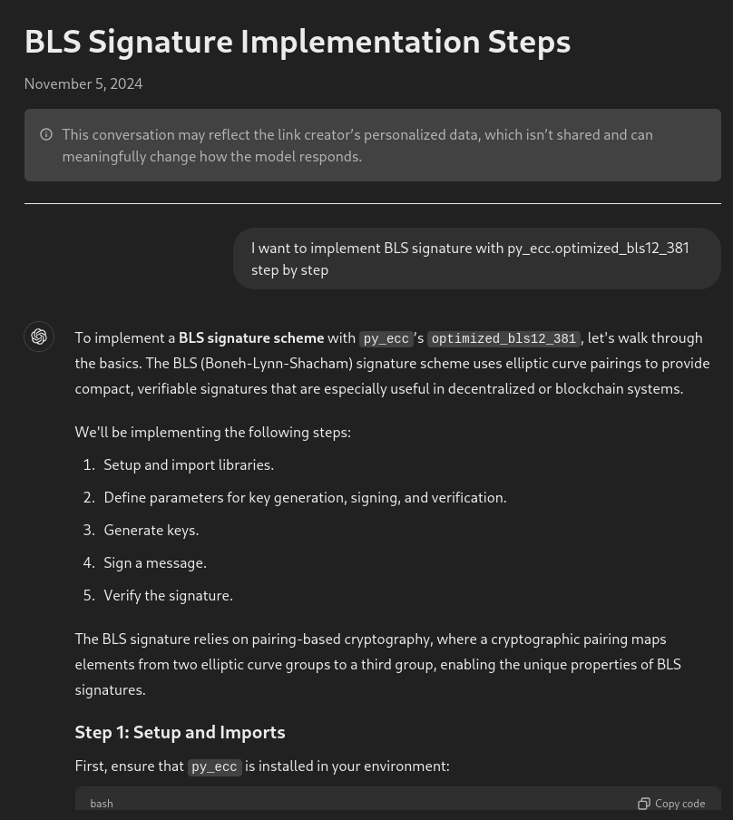
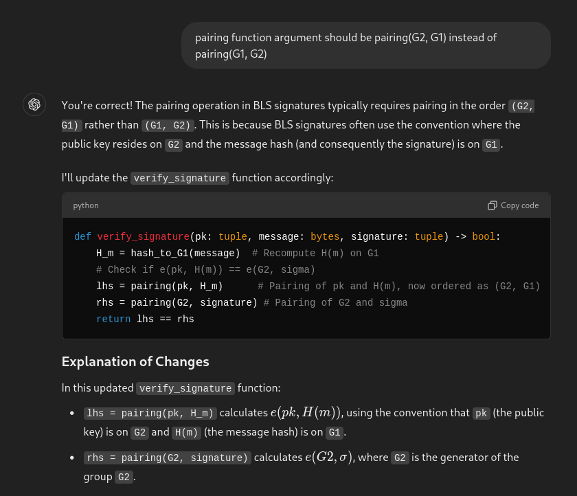
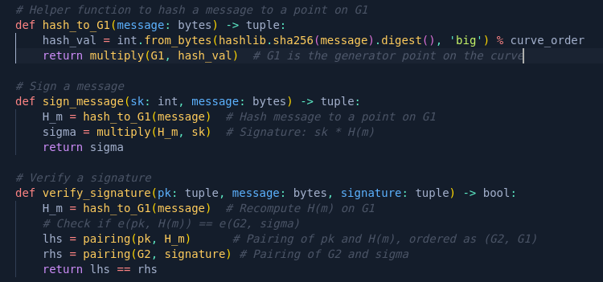
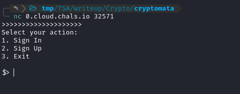
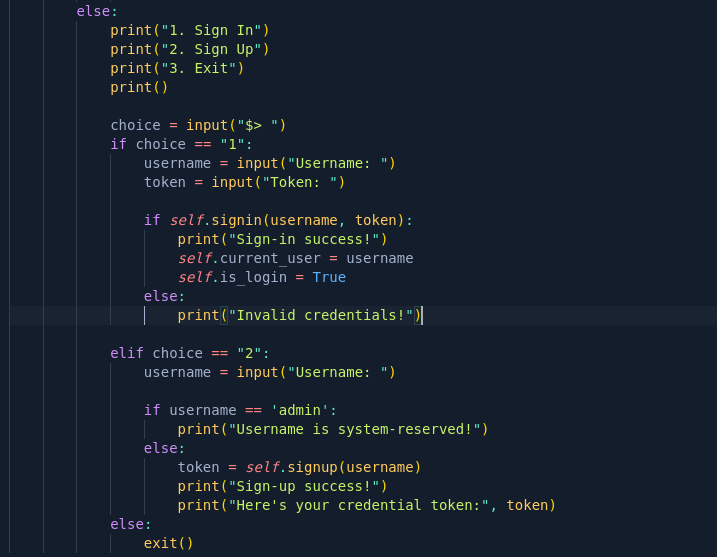
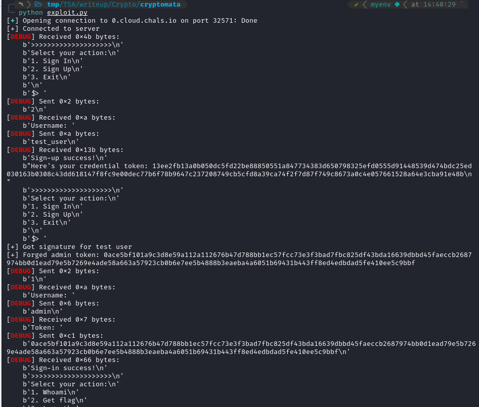
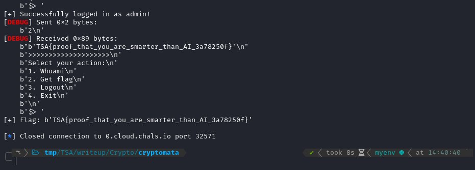

+++
date = '2024-11-10T19:00:07+07:00'
draft = false
title = '[TSA Cyber Champion 2024] Cryptography 101 Writeup'
tags = [
    "Cryptography",
    "RSA",
    "BLS Signature",
    "CTF"
]
categories = [
    "Cryptography",
    "CTF Writeup"
]
image = "image-50.png"
+++

# [TSA Cyber Champion 2024] Cryptography 101 Writeup

Writeup ini akan membahas bagaimana saya menyelesaikan soal Cryptography 101 dan Cryptomata dari TSA Cyber Champion 2024. Soal-soal ini melibatkan pemahaman tentang RSA dan BLS Signature.

## Cryptography 101

### Deskripsi Soal

Pada soal ini, saya diberikan sebuah file `chall.txt`. Isi dari file `chall.txt` ini adalah sebagai berikut:



File ini berisi `ciphertext` (c), `modulus` (n), dan `exponent publik` (e), yang merupakan komponen dasar dalam enkripsi RSA. Tujuan saya adalah mendekripsi `c` untuk mendapatkan flag.

### Analisis

Untuk menyelesaikan soal ini, saya perlu melakukan beberapa perhitungan dan membuat kode program. Secara garis besar, langkah-langkahnya adalah:

1.  **Faktorisasi Nilai `n`:**

    - Modulus `n` merupakan hasil perkalian dua bilangan prima `p` dan `q`. Dengan faktorisasi ini, saya bisa mendapatkan nilai `p` dan `q`, yang diperlukan untuk menghitung nilai `φ(n)` (Euler's Totient Function).

2.  **Menghitung `φ(n)`:**

    - Langkah selanjutnya adalah menghitung `φ(n)`, yang dirumuskan sebagai `(p-1) * (q-1)`. Nilai `φ(n)` ini penting untuk mencari _private exponent_ (`d`).

3.  **Menghitung _Private Exponent_ `d`:**

    - Nilai _private exponent_ `d` dihitung sebagai invers modular dari `e` terhadap `φ(n)`, menggunakan fungsi `pow(e, -1, φ(n))`. Nilai `d` ini akan menjadi kunci privat yang digunakan untuk mendekripsi `c`.

4.  **Dekripsi `c` menggunakan `d` dan `n`:**

    - Dengan `d` yang diperoleh, saya dapat mendekripsi `c` menggunakan rumus `m = c^d mod n`, di mana `m` adalah _plaintext_ atau flag.

5.  **Konversi Hasil Dekripsi ke _Plaintext_:**
    - Hasil dekripsi (`m`) adalah angka besar yang perlu dikonversi ke dalam bentuk string agar bisa dibaca. Saya akan mengonversi `m` ke format bytes dan mendekodenya ke UTF-8 untuk mendapatkan flag.

### Solver

Berikut adalah script solver yang saya buat menggunakan Python:

```python
import sympy
# fungsi untuk faktorasi n menjadi dua bilangan prima p dan q
def factor_n(n):
   factors = sympy.factorint(n)
   if len(factors) == 2:
       p, q = list(factors.keys())
       return p, q
   else:
       raise ValueError("Faktorasi n tidak menghasilkan dua bilangan prima.")

# fungsi untuk menghitung φ(n)
def compute_phi(p, q):
   return (p - 1) * (q - 1)

# fungsi untuk menghitung d (private exponent) menggunakan invers modular
def compute_d(e, phi_n):
   return pow(e, -1, phi_n)

# fungsi untuk mendekripsi ciphertext menggunakan d dan n
def decrypt(c, d, n):
   return pow(c, d, n)
def main():
   # chall.txt
   c = 231722077914684998818993776518942509384465803531548983146869754932667754136315007943497593396644630089073196170276638447665765624960333289097324447779290700092664403080584161276778064977902852018557301618273474139777712464709585187730351308079009718870031364399745764326436147001877583703027251271265576350621173

   e = 65537

   n = 257208938346934642693512128888810986151634836498153528507638790770764504946719195736987613302526116425873247750032929224521429342437621496424825810959518932424007107126934957421561529561264636001476988808843995824395131838577901446930016348590793828420808295335603083382120208905347497068915850813369038886980997

   # 1. faktorasi n
   print("Faktorasi n...")
   p, q = factor_n(n)
   print(f"p: {p}, q: {q}")

   # 2. hitung φ(n)
   print("Menghitung φ(n)...")
   phi_n = compute_phi(p, q)
   print(f"φ(n): {phi_n}")

   # 3. hitung d (private exponent)
   print("Menghitung d...")
   d = compute_d(e, phi_n)
   print(f"d: {d}")

   # 4. dekripsi ciphertext untuk mendapatkan m (flag)

   print("Mendekripsi ciphertext...")
   m = decrypt(c, d, n)
   # mengonversi hasil deskripsi ke dalam bentuk teks
   # hasil dekripsi berupa angka yang harus diubah menjadi teks (string).
   m_bytes = m.to_bytes((m.bit_length() + 7) // 8, byteorder='big')

   try:

       flag = m_bytes.decode('utf-8')
       print(f"Flag: {flag}")
   except UnicodeDecodeError:
       print(f"Hasil dekripsi berupa bytes yang tidak dapat didekode ke teks UTF-8: {m_bytes}")

if __name__ == "__main__":

   main()
```

Setelah menjalankan script solver, saya mendapatkan flag-nya!



### Solusi

**Flag:** `TSA{Crypto_101_d5b55ff525198ba6}`

## Cryptography - [cryptomata]

### Deskripsi Soal

Pada soal cryptomata, saya diberikan sebuah deskripsi untuk penyelesaian soal, akses netcat untuk melakukan koneksi ke server soal, dan juga sebuah file zip yang berisi _source code_ dari soal tersebut.

Pada deskripsi soalnya, soal ini dibuat oleh AI (ChatGPT) dan diberikan URL ChatGPT-nya: [https://chatgpt.com/share/6729a0f4-ebd0-800e-96bd-d2e2522210bb](https://chatgpt.com/share/6729a0f4-ebd0-800e-96bd-d2e2522210bb)



### Analisis

Dari deskripsi, pembuat soal ingin menerapkan tanda tangan BLS dengan `py_ecc.optimized_bls12_381`. Selain itu, _probset_ ingin argumen fungsi berpasangan harus berpasangan `(G2, G1)`.



Server menggunakan _library_ `py_ecc` untuk implementasi BLS signature dengan komponen utama:



Ketika saya coba koneksikan ke server, tampilannya seperti ini:



Untuk programnya, bisa dilihat pada _source code_ zip yang telah diekstrak pada file `challange.py`.



Dari kode tersebut, saya mengetahui bahwa server ini memiliki beberapa fitur:

1.  **Sign Up:** Mendaftar user baru dan mendapatkan token.
2.  **Sign In:** Login dengan username + token.
3.  **Get Flag:** Hanya bisa diakses oleh admin.

Dari BLS signature ini, saya tahu bahwa ia punya sifat homomorphic. Artinya:

- Jika kita punya signature `A = sk * H(user)`
- Dan kita mau signature `B = sk * H(admin)`
- Kita bisa pakai matematika modular untuk transformasi signature A ke B

### Eksploitasi

Tahapan eksploitasinya adalah sebagai berikut:

1.  Daftar sebagai user biasa untuk mendapatkan token.
2.  Hitung nilai hash untuk user dan admin.
3.  Hitung _scalar_ untuk transformasi signature.
4.  Generate admin signature.
5.  Login sebagai admin dan ambil flag.

Berikut adalah script exploit yang saya buat:

```python
from pwn import *
from py_ecc.optimized_bls12_381 import G1, G2, add, multiply, pairing, normalize, FQ, neg

import hashlib
from py_ecc.optimized_bls12_381.optimized_curve import curve_order

# Enable debugging
context.log_level = 'debug'

def hash_to_G1(message: bytes) -> tuple:
   hash_val = int.from_bytes(hashlib.sha256(message).digest(), 'big') % curve_order
   return multiply(G1, hash_val)

def serialize(point):
   xy = normalize(point)
   b = int.to_bytes(int(xy[0]), 48, 'big')
   b += int.to_bytes(int(xy[1]), 48, 'big')
   return b.hex()

def deserialize(token):
   token_bytes = bytes.fromhex(token)
   x = int.from_bytes(token_bytes[:48], 'big')
   y = int.from_bytes(token_bytes[48:], 'big')
   return (FQ(x), FQ(y), FQ(1))

def exploit():
   try:

       # Connect to the server
       conn = remote('0.cloud.chals.io', 32571, timeout=20)
       print("[+] Connected to server")


       # Get a user signature
       conn.recvuntil(b'$> ')
       conn.sendline(b'2')  # Sign Up
       conn.recvuntil(b'Username: ')
       username = b'test_user'
       conn.sendline(username)

       conn.recvuntil(b"Here's your credential token: ")
       user_token = conn.recvline().strip().decode()

       user_sig = deserialize(user_token)

       print(f"[+] Got signature for test user")

       # Calculate necessary points
       H_user = hash_to_G1(username)
       H_admin = hash_to_G1(b'admin')

       # Calculate scalar needed to transform user signature to admin signature
       # If sig_user = sk * H_user, we need to find x where:
       # sig_admin = sk * H_admin = x * sig_user
       # Therefore: x = H_admin * H_user^(-1)

       h_user_val = int.from_bytes(hashlib.sha256(username).digest(), 'big') % curve_order
       h_admin_val = int.from_bytes(hashlib.sha256(b'admin').digest(), 'big') % curve_order
       scalar = (h_admin_val * pow(h_user_val, -1, curve_order)) % curve_order

       # Generate admin signature
       admin_sig = multiply(user_sig, scalar)
       admin_token = serialize(admin_sig)
       print(f"[+] Forged admin token: {admin_token}")


       # Try to login as admin
       conn.recvuntil(b'$> ')
       conn.sendline(b'1')  # Sign In
       conn.recvuntil(b'Username: ')
       conn.sendline(b'admin')
       conn.recvuntil(b'Token: ')
       conn.sendline(admin_token.encode())


       # Check if login successful
       response = conn.recvuntil(b'$> ').decode()
       if "Sign-in success!" in response:
           print("[+] Successfully logged in as admin!")

           conn.sendline(b'2')  # Get flag
           flag = conn.recvline().decode()
           print(f"[+] Flag: {flag}")
       else:
           print("[-] Login failed")
           print(f"Response: {response}")

   except Exception as e:
       print(f"[-] Error occurred: {str(e)}")
   finally:
       conn.close()
if __name__ == '__main__':
   exploit()
```

Setelah menjalankan script exploit, saya berhasil mendapatkan flag!





### Solusi

**Flag:** `TSA{proof_that_you_are_smarter_than_AI_3a78250f}`
