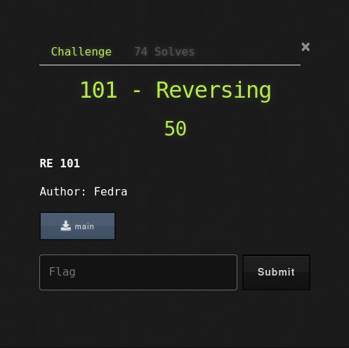
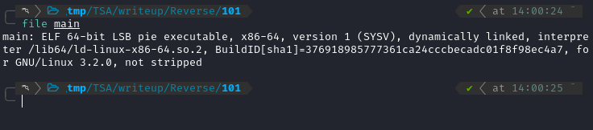
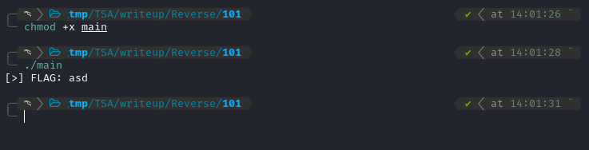
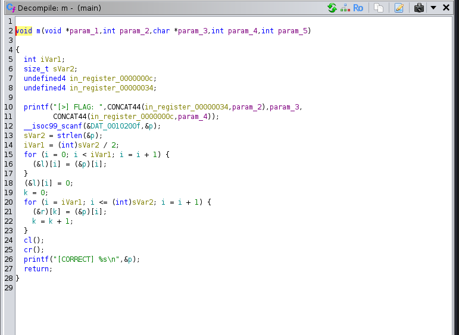
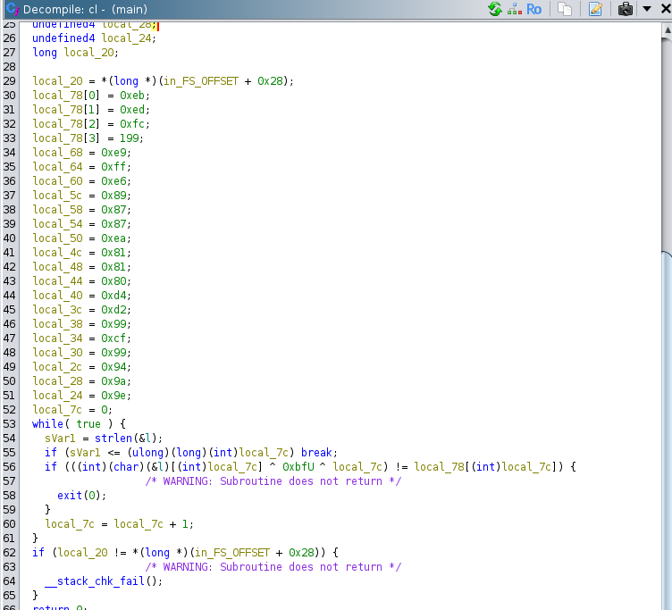
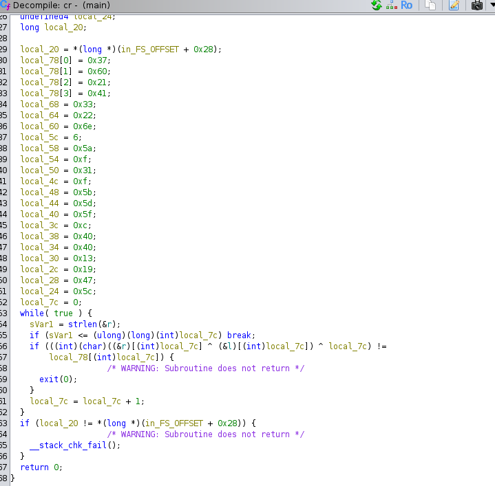
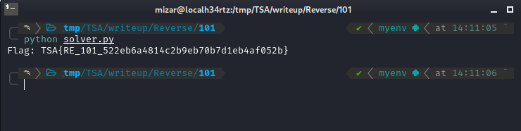

+++
date = '2024-11-10T19:00:07+07:00'
draft = false
title = '[TSA Cyber Champion 2024] - Reverse Engineering 101 Writeup'
tags = [
    "Reverse Engineering",
    "Ghidra",
    "CTF",
    "XOR"
]
categories = [
    "Reverse Engineering",
    "CTF Writeup"
]
image = "image-31.png"
+++

## Deskripsi Soal



Pada soal ini, saya diberikan sebuah file bernama `main`.

Pertama, saya coba cek dulu file `main` ini.



Lalu, saya coba jalankan programnya.



Program meminta inputan "FLAG". Saya coba masukkan sembarang, dan program langsung berhenti. Oke, sepertinya kita harus menganalisis program ini lebih lanjut.

## Analisis Program

Untuk menganalisis program ini, saya menggunakan Ghidra.

Setelah dianalisis, saya menemukan fungsi `m` (main) yang berhasil di-decompile. Berikut adalah kode decompile-nya:



Selain fungsi `main`, saya juga menemukan dua fungsi penting lainnya, yaitu `cl` dan `cr`. Fungsi `cl` ini sepertinya untuk validasi bagian kiri dari flag, sedangkan `cr` untuk validasi bagian kanan.

### Fungsi cl()

Berikut adalah kode dari fungsi `cl()`:



### Fungsi cr()

Berikut adalah kode dari fungsi `cr()`:



Dari analisis kode, saya menyimpulkan cara kerja programnya adalah sebagai berikut:

1.  Input flag dibagi menjadi dua bagian sama panjang, yaitu bagian kiri (`l`) dan bagian kanan (`r`).
2.  Fungsi `cl()` mengecek bagian kiri dengan operasi XOR.
3.  Fungsi `cr()` mengecek bagian kanan dengan operasi XOR terhadap bagian kiri.

## Membuat Solver

Karena saya sudah memahami cara kerja program, saya membuat script solver menggunakan Python untuk mendapatkan flag. Berikut adalah script solver yang saya buat:

```python
def get_left_part(length):
   # values from cl() function
   target_values = [
       0xeb, 0xed, 0xfc, 0xc7,
       0xe9, 0xff, 0xe6, 0x89,
       0x87, 0x87, 0xea, 0x81,
       0x81, 0x80, 0xd4, 0xd2,
       0x99, 0xcf, 0x99, 0x94,
       0x9a, 0x9e
   ]

   # solve for left part: c[i] ^ 0xbf ^ i = target
   # Therefore: c[i] = target ^ 0xbf ^ i
   left = ""

   for i in range(len(target_values)):
       char = target_values[i] ^ 0xbf ^ i
       left += chr(char)
   return left

def get_right_part(left_part):
   # Values from cr() function
   target_values = [
       0x37, 0x60, 0x21, 0x41,
       0x33, 0x22, 0x6e, 0x06,
       0x5a, 0x0f, 0x31, 0x0f,
       0x5b, 0x5d, 0x5f, 0x0c,
       0x40, 0x40, 0x13, 0x19,
       0x47, 0x5c
   ]

   # Solve for right part: (r[i] ^ l[i]) ^ i = target
   # Therefore: r[i] = (target ^ i) ^ l[i]

   right = ""

   for i in range(len(target_values)):
       char = (target_values[i] ^ i) ^ ord(left_part[i])
       right += chr(char)
   return right

def main():
   # Get left part of the flag
   left_part = get_left_part(22)  # Length based on array sizes
   # Get right part of the flag using left part
   right_part = get_right_part(left_part)
   # combine to get full flag
   flag = left_part + right_part
   print("Flag:", flag)

if __name__ == "__main__":
   main()
```

Saya menjalankan script solver ini, dan mendapatkan flag-nya!



## Solusi

**Flag:** `TSA{RE_101_522eb6a4814c2b9eb70b7d1eb4af052b}`
