+++
date = '2024-11-10T19:00:07+07:00'
draft = false
title = '[TSA Cyber Champion 2024] - Web Exploit 101 Writeup'
tags = [
    "LFI",
    "Web Exploit",
    "Command Injection",
    "File Upload",
    "RCE",
]
categories = [
    "Web Exploit",
    "CTF Writeup"
]
image = "image-8.png"
+++

## Deskripsi Soal

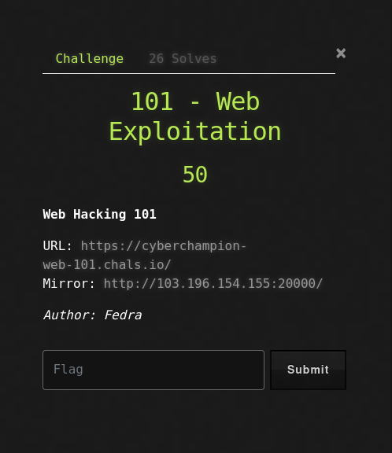

Soal ini hanya memberikan sebuah tautan (link) website tanpa deskripsi tambahan, sehingga pendekatan _blackbox testing_ diperlukan.

URL: [https://cyberchampion-web-101.chals.io/](https://cyberchampion-web-101.chals.io/)

Mirror: [http://103.196.154.155:20000/](http://103.196.154.155:20000/)

Tampilan awal website:

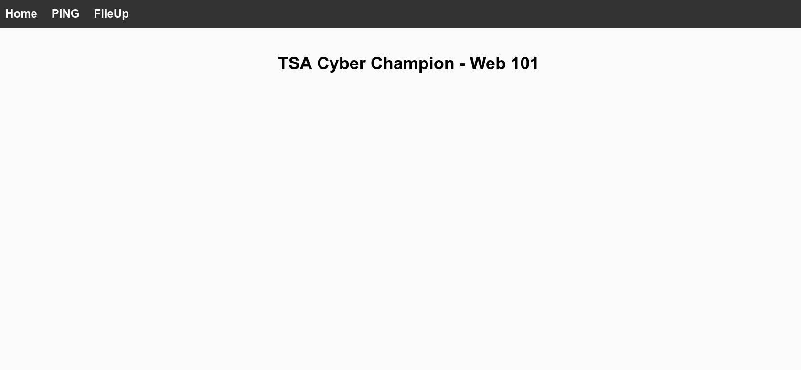

Website ini memiliki dua menu utama: "Ping" dan "File Up".

## Analisis Awal

### Menu Ping

Menu "Ping" memiliki dua potensi kerentanan:

1.  **Local File Inclusion (LFI):** Parameter `page` pada URL `https://cyberchampion-web-101.chals.io/index.php?page=ping.php` terlihat mencurigakan dan mungkin rentan terhadap LFI.
2.  **Command Injection:** Input pada fitur "Ping" mungkin rentan terhadap Command Injection.

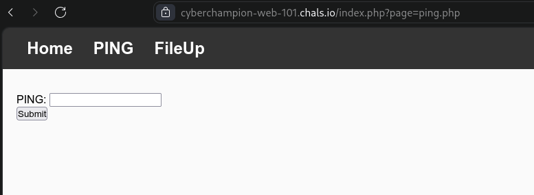

### Eksplorasi LFI

Mencoba mengakses URL `https://cyberchampion-web-101.chals.io/index.php?page=` menghasilkan pesan error yang mengungkapkan path website: `/var/www/html/pages/`. Ini mengonfirmasi bahwa website menggunakan fungsi `include()` untuk memanggil file.

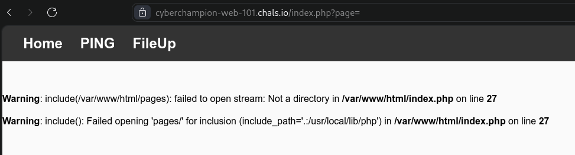

Dengan informasi ini, dicoba melakukan _path traversal_ untuk mengakses file sensitif, seperti `/etc/passwd`.

`https://cyberchampion-web-101.chals.io/index.php?page=../../../../etc/passwd`

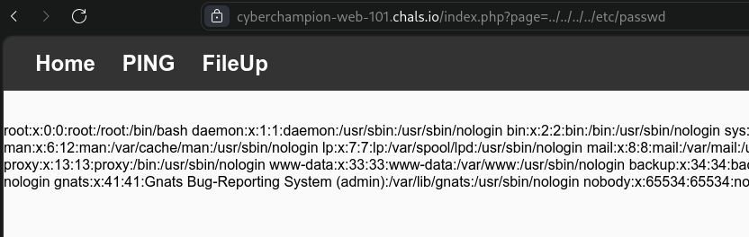

Eksploitasi LFI berhasil, yang berarti website ini memiliki celah LFI.

### Percobaan yang Gagal

Beberapa percobaan berikut dilakukan, namun tidak berhasil:

- Mencoba menggunakan wrapper dengan Burp Suite dan ekstensi Hackbar.

  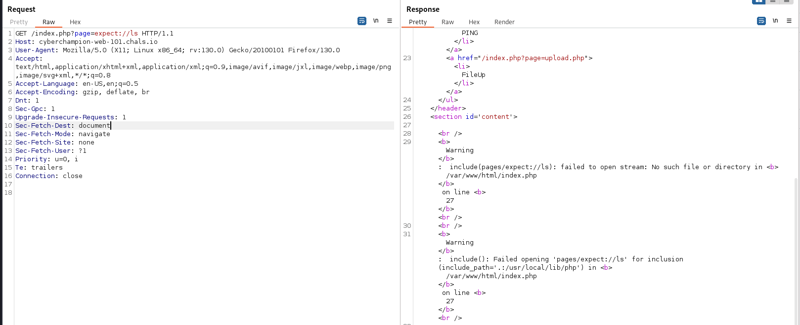

- Mencoba mengakses `/proc/self/environ` (berdasarkan referensi dari [https://www.exploit-db.com/papers/12886](https://www.exploit-db.com/papers/12886)).

  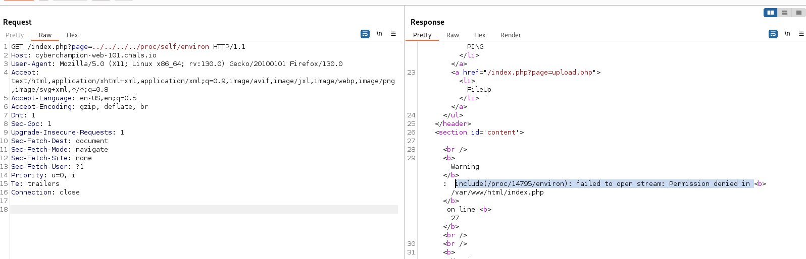

### Eksplorasi Command Injection

Mencoba fitur "Ping" dengan input `google.com`.

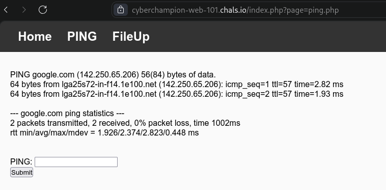

Fitur ini tampaknya mengeksekusi perintah "ping". Dicoba melakukan Command Injection dengan input:

`google.com; id`

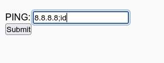

Input ini seharusnya mengeksekusi perintah `ping` dan `id`. Jika dicoba di Linux, hasilnya akan seperti ini:

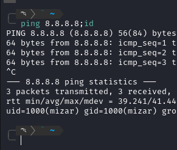

Namun, ketika dicoba pada website, hasilnya kosong (blank).

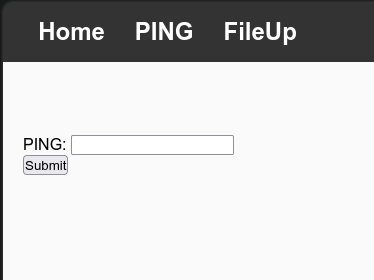

Berbagai upaya _bypass_ dicoba, tetapi tidak berhasil.

### Menu File Up

Karena upaya sebelumnya tidak berhasil, dicoba menu "File Up".

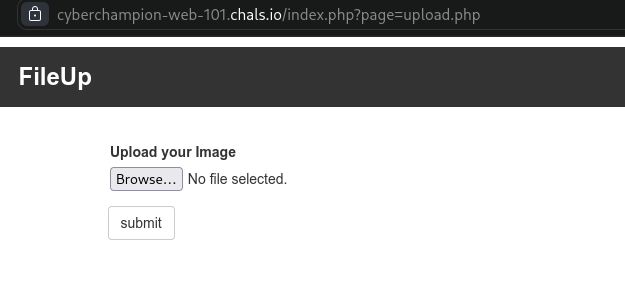

Mencoba mengunggah file gambar.

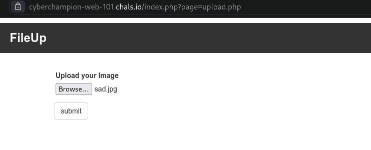

Setelah di-submit, tidak ada informasi apakah file berhasil diunggah atau tidak, dan tidak ada informasi lokasi file jika berhasil diunggah.

### Eksploitasi File Upload

Menggunakan Burp Suite untuk menganalisis proses upload. Awalnya, mencoba mengunggah file dengan nama yang sama ("sad.jpg"), tetapi gagal. Kemudian, mencoba dengan nama "sad1.jpg" dan berhasil.

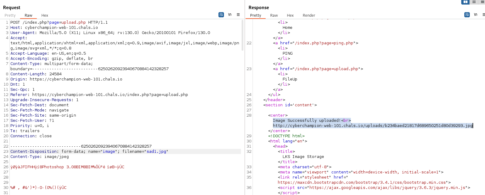

Pesan "Image Successfully uploaded!" dan tautan ke file yang diunggah diberikan:

`http://cyberchampion-web-101.chals.io/uploads/b234baed21817d689650251d80d39293.jpg`

Mengakses tautan tersebut menunjukkan bahwa file berhasil diunggah.

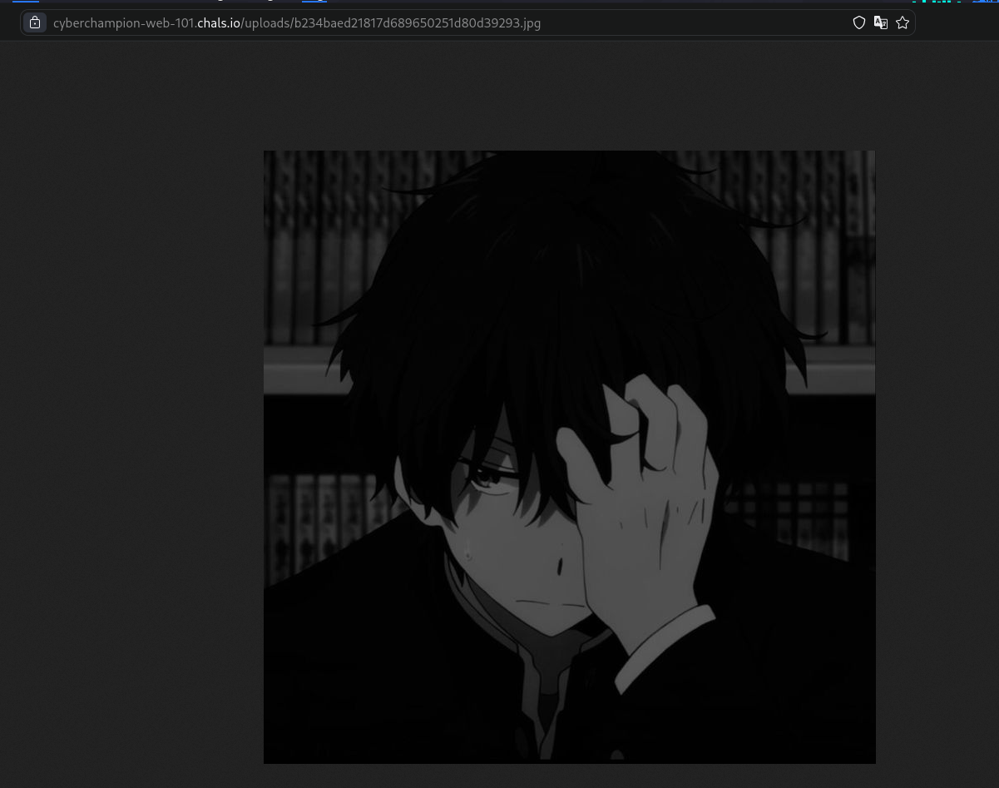

## Eksploitasi Lanjutan (LFI to RCE)

Mengacu pada artikel tentang memanfaatkan LFI untuk mencapai RCE:

[https://outpost24.com/blog/from-local-file-inclusion-to-remote-code-execution-part-2/](https://outpost24.com/blog/from-local-file-inclusion-to-remote-code-execution-part-2/)

Artikel tersebut menjelaskan bagaimana menggabungkan LFI dan File Upload untuk mencapai RCE. Kode PHP disisipkan ke dalam file gambar, kemudian diunggah. Selanjutnya, LFI digunakan untuk mengakses file gambar tersebut dan mengeksekusi kode PHP yang ada di dalamnya.

### Bypass dengan Header "GIF98a;"

Mencoba _bypass_ dengan menyisipkan header "GIF98a;" (berdasarkan referensi dari [https://github.com/malware-d/template/blob/master/example_attack/Bypassing%20File%20Upload%20Restrictions.md](https://github.com/malware-d/template/blob/master/example_attack/Bypassing%20File%20Upload%20Restrictions.md)).

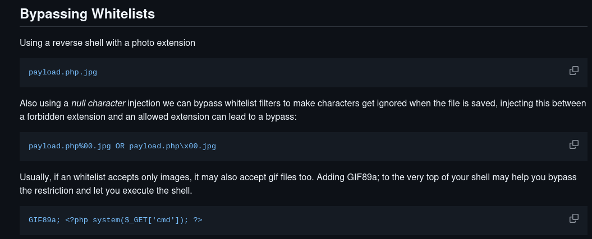

File `sad.jpg` diubah dengan menghapus semua isinya dan menggantinya dengan kode PHP yang disisipkan header "GIF98a;".

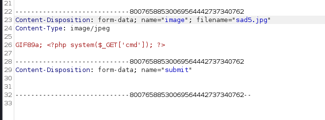

Mencoba mengakses file melalui LFI dengan menambahkan parameter `cmd`:

`https://cyberchampion-web-101.chals.io/index.php?page=../uploads/9c090a873b2789d317eb5bb5fe165329.jpg?cmd=id`

Hasilnya gagal.

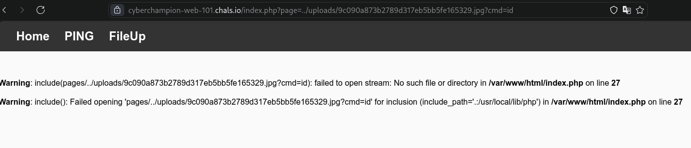

Kemudian, mencoba dengan format yang berbeda:

`https://cyberchampion-web-101.chals.io/index.php?page=../uploads/9c090a873b2789d317eb5bb5fe165329.jpg&cmd=id`

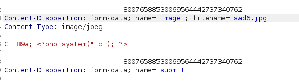

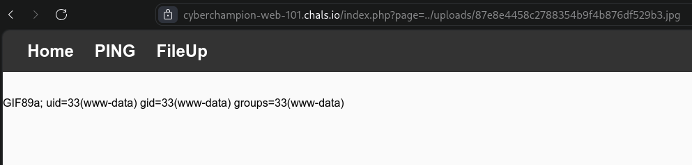

Eksploitasi berhasil! Sekarang, dicoba melakukan reverse shell untuk mendapatkan akses yang lebih leluasa.

### Reverse Shell

Menggunakan `ngrok` untuk melakukan port forwarding.

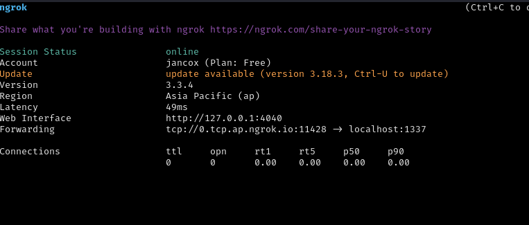

Port 1337 diaktifkan.

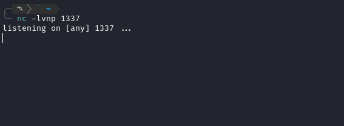

Menggunakan reverse shell dari Pentest Monkey ([https://www.revshells.com/](https://www.revshells.com/)).

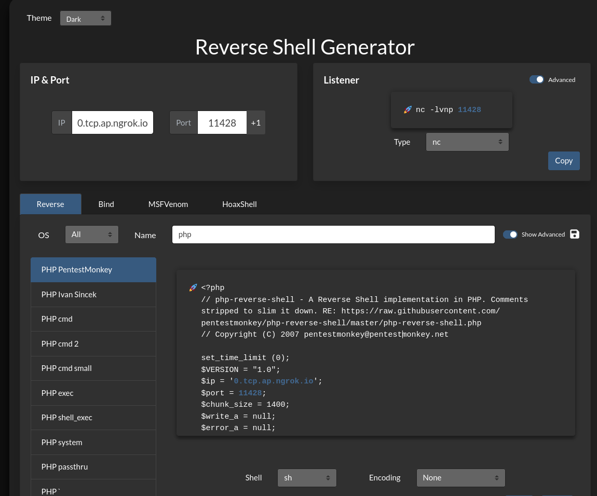

Skrip reverse shell disesuaikan dengan port yang diberikan oleh `ngrok`.

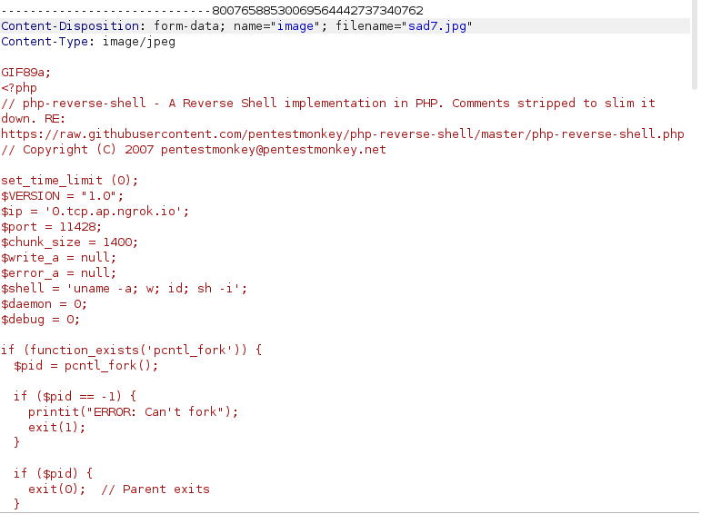

Skrip PHP yang diunggah diubah dengan skrip reverse shell. Kemudian, diakses melalui LFI.

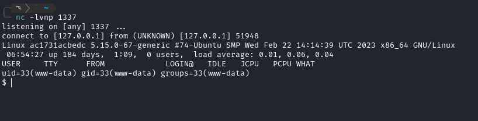

Netcat mendengarkan pada port 1337.

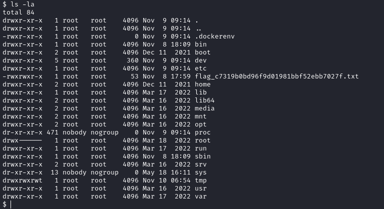

Reverse shell berhasil!

### Mencari Flag

Setelah mendapatkan reverse shell, dicari file yang berisi flag.

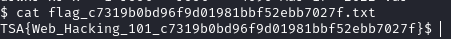

Ditemukan file bernama `flag`. Langsung saja dicek isinya.

## Solusi

**Flag:** `TSA{Web_Hacking_101_c7319b0bd96f9d01981bbf52ebb7027f}`
