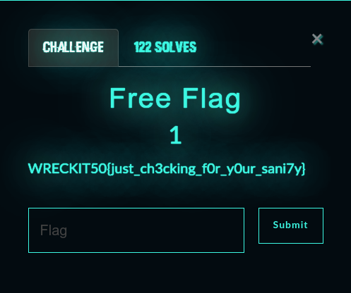
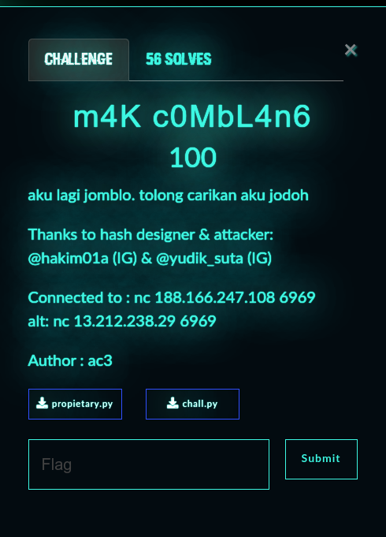
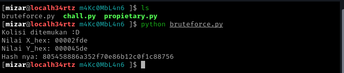
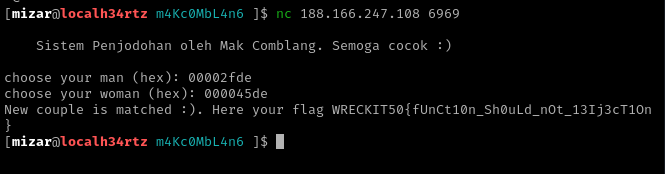

+++
date = '2024-08-10T15:42:50+07:00'
draft = false
title = '[Wreck-IT 5.0 CTF] Writeup'
tags = [
    "HORTEX",
    "Collision attack",
]
categories = [
    "Cryptography",
    "CTF Writeup"
]
image = "image-1.png"
+++

# ACT_CIAMIS

with agrx

## MISC

### [ Free Flag ] <a name="misc"></a><a name="free-flag"></a>

Soal:



Sesuai dengan namanya, soal ini memang memberikan flag secara cuma-cuma. kami langsung memasukkan flag yang tertera pada deskripsi soal, dan ternyata valid!

**Flag:** `WRECKIT50{just_ch3cking_f0r_y0ur_sani7y}`

## CRYPTO <a name="crypto"></a>

### [ m4K c0MbL4n6 ] <a name="m4k-c0mbl4n6"></a>

Soal:



Pada soal ini, kami diberikan dua buah file, yaitu `propietary.py` dan `chall.py`.

Berikut adalah isi dari file `propietary.py`:

**propietary.py**

```python
 import math

 def biner_ke_hex(biner):
   desimal = int(biner, 2)
   heksadesimal = hex(desimal)
   return heksadesimal[2:]

​

 def float_bin(my_number, places=3):
   my_whole, my_dec = str(my_number).split(".")
   my_whole = int(my_whole)
   res = (str(bin(my_whole))+".").replace('0b','')

   for x in range(places):
     my_dec = str('0.')+str(my_dec)
     temp = '%1.20f' %(float(my_dec)\*2)
     my_whole, my_dec = temp.split(".")
     res += my_whole
   return res

​

 def cyclic_left_shift(value, shift):
   return ((value << shift) & 0xFFFFFFFF) | (value >> (32 - shift))

 def binary32(n):
   sign = 0
   if n < 0:
     sign = 1
     n = n \* (-1)
   p = 30

   dec = float_bin(n, places=p)

   dotPlace = dec.find('.')
   onePlace = dec.find('1')

   if onePlace > dotPlace:
     dec = dec.replace(".","")
     onePlace -= 1
     dotPlace -= 1

   elif onePlace < dotPlace:
     dec = dec.replace(".","")
     dotPlace -= 1
   mantissa = dec[onePlace+1:]

   exponent = dotPlace - onePlace
   exponent_bits = exponent + 127
   exponent_bits = bin(exponent_bits).replace("0b",'')
   mantissa = mantissa[0:23]

   final = str(sign) + exponent_bits.zfill(8) + mantissa
   return final

 def parse_input(x):
   if len(x) != 32:
     raise ValueError("Input harus 32-bit string")

   xl = x[:12]
   xm = x[12:28]
   xr = x[28:]

   return xl, xm, xr

 def calculate_parameters(xl, xm, xr):
   gama_awal = int(xl, 2) \* (1 / 2\*\*12)
   eta = (int(xm, 2) \* (2 / 2\*\*16)) + 2
   k = (int(xr, 2) \* (1 / 2\*\*4)) + 10.01
   n = math.floor(6 \* gama_awal)

   return gama_awal, eta, k, n

​
 def fL(eta, gama_n):
   return eta _ gama_n _ (1 - gama_n)

 def gamma_function(gama_awal, eta, k, n, i):
   gama = gama_awal
   for i in range(n + i):
     gama = (2**k / 2**fL(eta, gama)) % 1
   return gama

​

 def ELM(x):
   xl, xm, xr = parse_input(x)
   gama_awal, eta, k, n = calculate_parameters(xl, xm, xr)
   gama_n1 = gamma_function(gama_awal, eta, k, n, 1)
   gama_n2 = gamma_function(gama_awal, eta, k, n, 2)

   w1 = binary32(gama_n1 \* (10\*\*(10)))
   w2 = binary32(gama_n2)
   y = (cyclic_left_shift(int(w1,2), 17)) ^ (int(w2,2))

   return format(y, '032b')

 def transform_f(x):
   blocks = [x[i:i+32] for i in range(0, 256, 32)]
   x_prev = '0' \* 32

   for i in range(8):
     x_curr = blocks[i]
     blocks[i] = ELM(format(int(x_curr, 2) ^ int(x_prev, 2),'032b'))
     x_prev = blocks[i]


   blocks[0] = format((cyclic_left_shift(int(blocks[0], 2), 19) + (cyclic_left_shift(int(blocks[2], 2), 9) % (2\*\*32))), '032b')
   blocks[4] = format(cyclic_left_shift(int(blocks[4], 2) ^ cyclic_left_shift(int(blocks[2], 2), 9), 7), '032b')
   blocks[5] = format(cyclic_left_shift(int(blocks[5], 2) ^ cyclic_left_shift(int(blocks[3], 2), 17), 13), '032b')
   blocks[6] = format((int(blocks[6], 2) + int(blocks[4], 2)) % (2\*\*32), '032b')
   blocks[7] = format(cyclic_left_shift(int(blocks[7], 2), 11) ^ int(blocks[5], 2), '032b')
   blocks[1] = format(int(blocks[1], 2) + int(blocks[5], 2), '032b')
   blocks[2] = format(cyclic_left_shift(int(blocks[2], 2), 9) ^ int(blocks[6], 2), '032b')
   blocks[3] = format((cyclic_left_shift(int(blocks[3], 2), 17) + int(blocks[1], 2)) % (2\*\*32), '032b')
   return ''.join(blocks)

 def convert_to_32bit_hex(input_hex):
   input_int = int(input_hex[:8], 16) # Ambil 8 digit pertama jika lebih panjang dari 8 digit
   bit_string = format(input_int, '032b') # Konversi integer ke 32 bit biner dengan leading zeros
   return bit_string

​
 # Fungsi hash HORTEX
 def HORTEX(input_hex):
   X_bin = convert_to_32bit_hex(input_hex)
   pad_len = (64 - (len(X_bin) % 64)) % 64
   X_padded = X_bin + '1' + '0' \* (pad_len - 1)

   r, c = 64, 192
   state = '0' \* (r + c)

   state_int = int(state[:r], 2)
   block_int = int(X_padded, 2)
   updated_state = format(state_int ^ block_int, '064b') + '0'\*c
   after_abs = transform_f(updated_state)

   s0 = transform_f(after_abs)
   h1 = s0[:r]
   state = transform_f(s0)
   h2 = state[:r]

   h1_hex = format(int(h1, 2), '016x')
   h2_hex = format(int(h2, 2), '016x')

   return h1_hex + h2_hex
```

Selanjutnya, berikut adalah isi dari file `chall.py`:

**chall.py**

```python
from propietary import \*

def print_diagram():
 diagram = """
 Sistem Penjodohan oleh Mak Comblang. Semoga cocok :)
 """
 print(diagram)

if **name** == "**main**":
 print_diagram()

while True:
    X_hex = input('choose your man (hex): ')
    Y_hex = input('choose your woman (hex): ')

    hash_value1 = HORTEX(X_hex)
    hash_value2 = HORTEX(Y_hex)

    if hash_value1 == hash_value2 and X_hex != Y_hex:
        print("New couple is matched :). Here your flag WRECKIT50{REDACTED}")
        break
    else:
        print("Try again")
        break
```

Dari analisis yang kami lakukan, file `propietary.py` berisi fungsi-fungsi untuk melakukan hashing dan manipulasi bit yang digunakan dalam algoritma hashing, yaitu 'HORTEX'.

```python
def HORTEX(input_hex):
X_bin = convert_to_32bit_hex(input_hex)
pad_len = (64 - (len(X_bin) % 64)) % 64
X_padded = X_bin + '1' + '0' \* (pad_len - 1)
```

Sejujurnya, kami baru pertama kali mendengar tentang HORTEX ini. Setelah mencari informasi, kami menemukan sebuah website yang menjelaskan tentang HORTEX.

**Hortex** adalah fungsi hash alternatif berbasis chaotic sponge yang diusulkan yang menghasilkan panjang keluaran sebesar 128-bit. Algoritma Hortex diuji dengan menggunakan Cryptographic Randomness Testing (CRT) untuk mengevaluasi sifat keacakan yang dimiliki dan **diserang** menggunakan **serangan kolisi** Yuval dan **_bruteforce_** secara teoritis untuk mengevaluasi keamanannya. Sumber: [https://kc3.poltekssn.ac.id/opac/index.php?p=show_detail&id=11773&keywords=](https://kc3.poltekssn.ac.id/opac/index.php?p=show_detail&id=11773&keywords=)

Dari informasi tersebut, kami mendapatkan sedikit petunjuk, yaitu **serangan kolisi (Collision attack)** dan **brute force**.

File `chall.py` merupakan _source code_ yang berjalan pada server dengan alamat IP yang diberikan.

Jika dilihat dari _source code_ `chall.py`, program meminta dua inputan nilai dalam bentuk heksadesimal dari user, yaitu pada variabel `X_hex` dan `Y_hex`.

```python
    X_hex = input('choose your man (hex): ')
    Y_hex = input('choose your woman (hex): ')
```

Kedua inputan tersebut kemudian di-hash menggunakan fungsi **HORTEX**.

```python
    hash_value1 = HORTEX(X_hex)
    hash_value2 = HORTEX(Y_hex)
```

Setelah di-hash, program akan mengecek apakah nilai hash dari `X_hex` sama dengan `Y_hex`. Jika kedua hash tersebut sama dan nilai asli dari `X_hex` tidak sama dengan (`!=`) `Y_hex`, maka program akan menampilkan flag.

```python
    if hash_value1 == hash_value2 and X_hex != Y_hex:
        print("New couple is matched :). Here your flag WRECKIT50{REDACTED}")
        break
```

Artinya, pada soal ini, kami harus menemukan dua nilai heksadesimal yang berbeda, tetapi menghasilkan nilai hash yang sama menggunakan fungsi HORTEX.

Jadi, kesimpulannya, `propietary.py` berfungsi untuk menghitung hash 'HORTEX', dan `chall.py` berfungsi untuk menerima inputan user dan mencari collision pada fungsi hash HORTEX. Setelah itu, program akan menampilkan flag apabila dua input menghasilkan hash yang sama.

Untuk mendapatkan flag, kami harus mencari collision atau hash yang sama. Untuk mencarinya, kami menggunakan metode _brute force_ sesuai dengan petunjuk yang kami dapatkan sebelumnya. _Brute force_ di sini berarti mencoba berbagai kombinasi input dan melihat apakah hasilnya sama.

Untuk melakukan _brute force_, kami menggunakan script `bruteforce.py` berikut:

**bruteforce.py**

```python
from propietary import HORTEX

def find_collision():
 seen_hashes = {}

 for i in range(2**16): # menggunakan rentang 2-16 agar efisiensi
   X_hex = format(i, '08x') # Format menjadi hex 8 digit
   hash_value = HORTEX(X_hex)

   if hash_value in seen_hashes:
     print(f"Collision found:")
     print(f"X_hex: {seen_hashes[hash_value]}")
     print(f"Y_hex: {X_hex}")
     print(f"Hash: {hash_value}")
     return seen_hashes[hash_value], X_hex

   seen_hashes[hash_value] = X_hex

 print("No collision found.")
 return None


find_collision()
```

Setelah menjalankan script tersebut, kami mendapatkan hasil sebagai berikut:



Dari hasil _brute force_, kami mendapatkan nilai `X_hex` dan `Y_hex`. Selanjutnya, kami mencoba memasukkan inputan tersebut ke dalam program `chall.py`.



Setelah menunggu beberapa saat, akhirnya kami berhasil mendapatkan flag!

**Flag:** `WRECKIT50{fUnCt10n_Sh0uLd_nOt_13Ij3cT1On}`

SELESAI! Sebenarnya, ada banyak soal lain yang sudah kami coba, tetapi kami selalu mengalami kesulitan pada tahap akhir, seperti menemukan file zip yang dienkripsi dengan password. Hanya satu soal ini yang berhasil kami pecahkan dengan metode _brute force_.

Terima kasih Wreck IT 5.0! Soal-soalnya sangat menantang dan membuat kami mendapatkan banyak ilmu baru.
