+++
date = '2024-08-18T23:19:20+07:00'
draft = false
title = '[ZeroByte CTF 2024] Writeup'
tags = [
    "Painless RSA",
]
categories = [
    "Boot2Root",
    "Cryptography",
    "CTF Writeup"
]
image = "image-1.png"
+++

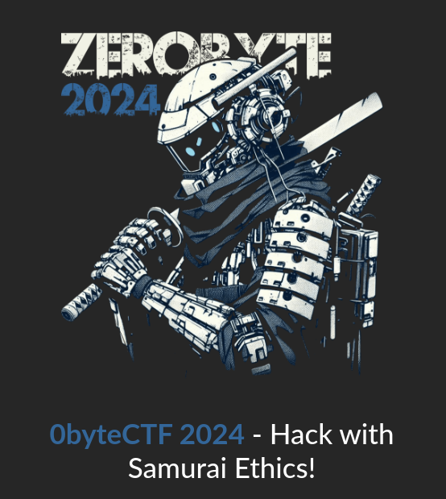

## Misc

### [ Free Flag 4 All ]

Soal pertama yang saya kerjakan yaitu soal yg ‘free flag’, karna lumayan buat point petama hehe

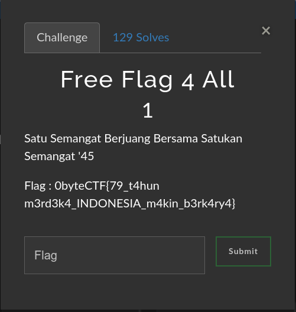

Di dalam deskripsi soal sudah terlihat flag nya.

flag: 0byteCTF{79_t4hun m3rd3k4_INDONESIA_m4kin_b3rk4ry4}

## Crypto

### [ Painless RSA ]

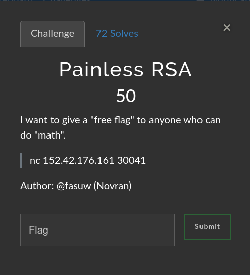

#### Executive Summary

Di soal ini, terdapat sebuah netcat untuk terhubung ke koneksi soal nya.Ketika saya mencoba menghubungkan nya dengan perintah ‘nc 152.42.176.161 300041’, maka hasilnya seperti berikut:

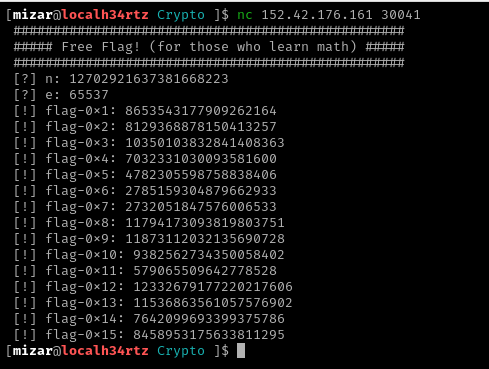

Dari hasil tersebut, sesuai judul soal nya yaitu soal kriptografi dengan “RSA”. Di RSA ini, biasanya terdapat sebuah parameter utama yaitu modulus “n” dan exponen publik “e”. Parameter tersebut gunanya untuk mengenkripsi data.

#### Technical Report

Dilihat hasil dari gambar tadi, ada beberapa ciphertext yaitu **“flag-0x1”** sampai **“flag-0x15”**. Ciphertext ini sudah dienkripsi dengan RSA. Untuk mendapatkan flag nya maka bisa dilakukan dengan cara dekripsi ciphernya.

Disini saya menggunakan program python untuk melakukan dekripsi nya, seperti berikut:

```python
import sympy
_# ambil dari hasil netcat tadi_
n = 12702921637381668223

e = 65537
_# Cipher texts_
cipher_texts = [
8653543177909262164,
8129368878150413257,
10350103832841408363,
7032331030093581600,
4782305598758838406,
2785159304879662933,
2732051847576006533,
11794173093819803751,
11873112032135690728,
9382562734350058402,
579065509642778528,
12332679177220217606,
11536863561057576902,
7642099693399375786,
8458953175633811295
]

_# disini difaktorkan nilai n untuk mendapatkan p dan q_
p, q = sympy.factorint(n).keys()

_# menghitung nilai phi(n)_
phi_n = (p - 1) \* (q - 1)

_# menghitung nilai d (private key exponent)_
d = pow(e, -1, phi_n)

_# membuat fungsi untuk dekripsi RSA_
def decrypt_rsa(c, d, n):
return pow(c, d, n)

_# proses meendekripsi cipher texts_
decrypted_flag = [decrypt_rsa(c, d, n) for c in cipher_texts]

_# mengkonversi hasil dekripsi ke string ASCII_
flag = ''.join([decrypted_value.to_bytes((decrypted_value.bit_length() + 7) // 8, 'big').decode() for decrypted_value in decrypted_flag])
print("Flag:", flag)
```

Pada kode diatas, saya menggunakan library Pythonyaitu sympy untuk memfaktorkan n, kemudian isa mendekripsi setiap bagian dari flag yang diberikan.

Setelah saya jalankan program nya, maka muncul flag dari soal ini

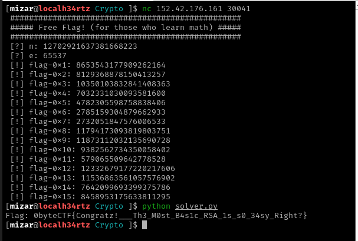

flag: Flag: 0byteCTF{Congratz!\_\_\_Th3_M0st_B4s1c_RSA_1s_s0_34sy_Right?}

#### Conclusion

Di soal ini melibatkan sebuah dekripsi flag yang telah dienkripsi menggunakan algoritma RSA. Selain itu diberikan nilai n (modulus), e (eksponen publik), dan beberapa cipher text (bagian-bagian dari flag yang terenkripsi) ketika menjalankan netcat nya.

Untuk menyelesaikannya, mencari nilai n terlebih dahulu dengan cara faktorisasi untuk mendapatkan bilangan prima ‘p’ dan ‘n’. Selanjutnya menghitung eksponen private (d) menggunakan rumus phi(n) = (p - 1) \* (q - 1), lalu gunakan nilai ‘e’ dan ‘phi(n)’ untuk menghitung eksponen privat d dengan rumus d = e^(-1) mod phi(n). Setelah mendapatkan eksponen private ‘d’nya, maka lanjut dengan deskripsi cipher text dengan rumus ‘m = c^d mod n’. Setelah di deskripsi (dari format numerik), agar flag tersebut bisa terbaca maka dikonversi ke format string.

## Boot2root

### [ Sembunyi ]

Note: Untuk soal ini, setelah saya submit flag tersebut, sialnya saya tidak membaca terlebih dahulu untuk peraturan boot2root ini. Peraturan di boot2root ini tidak boleh dengan cara bypass password root. Jadi cara yg saya lakukan ini salah

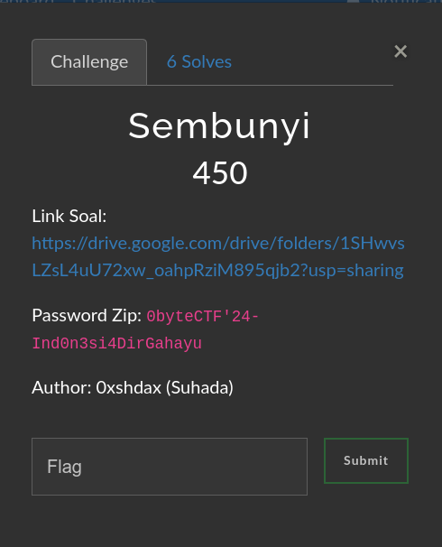

#### Executive Summary

Di soal ini dengan kategori boot2root, tidak ada hint untuk menyelesaikan flag nya. Hanya terdapat sebuah link soal dan juga password zip. Isi dari link tersebut merupakan file dengan format .7z

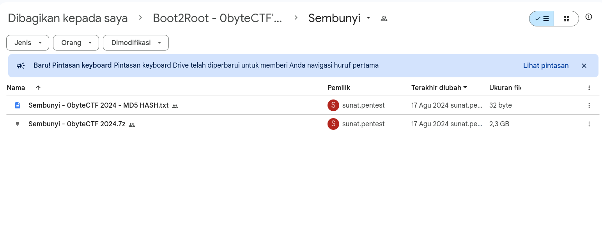

Setelah saya download file arsip tersebut, terdapat sebuah file dengan format .ova

Format .ova ini intinya itu sama kayak file ZIP gitu, tapi isinya bukan dokumen atau gambar, melainkan sebuah sistem operasi lengkap dengan aplikasinya, biasanya untuk virtual mesin. Dalam konteks ini, berarti sebuah virtual mesin yang sudah siapkan untuk mencari flag nya. Mesin ini harus dipasang pada laptop/pc masing-masing. Disini saya menggunakan Virtual Box.

#### Technical Report

Untuk menyelesaikan flag nya, pertama import file .ova ke software virtual machine, salah satunya virtual box.

Untuk Caranya di virtualbox, klik file-&gt;Import Appliance-&gt;Lalu masukan file .ova tadi-&gt;klik next-&gt;finish. Maka hasilnya akan seperti berikut

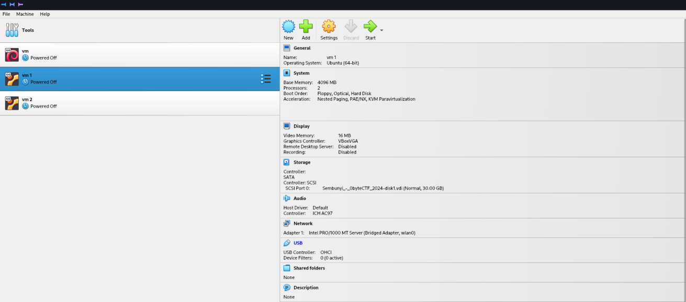

Setelah itu Lanjut dengan klik Start.

Setelah mesin nya dijalankan, maka akan menampilkan login server nya

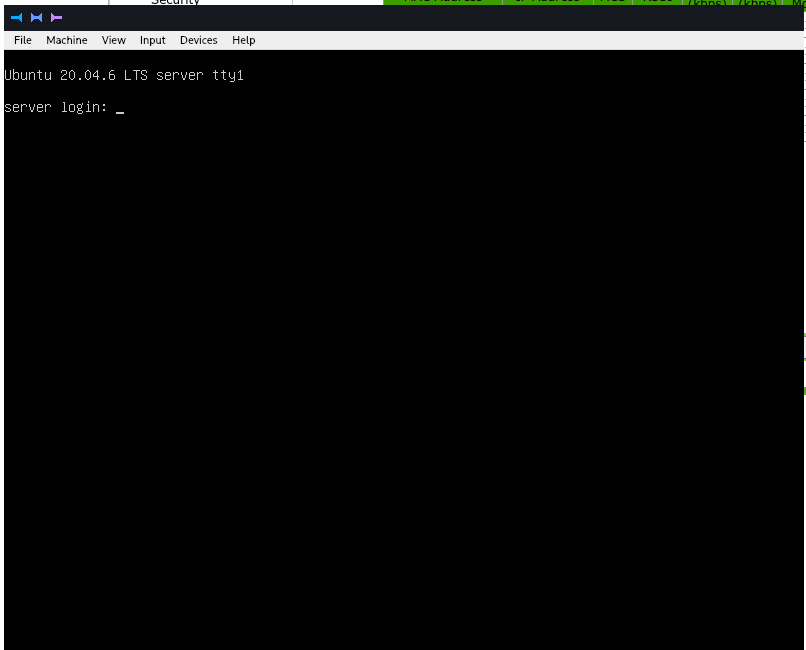

Disini saya belum tau username dan password, dan di hint juga tidak ditemukan. Untuk mendapatkan flag ini saya mencoba melakukan masuk ke akun root melalui recovery mode.

Untuk masuk ke recovery mode, caranya mematikan mesin nya terlebih dahulu, setelah itu jalankan kembali mesin nya dan dibarengi dengan tekan shift. Setelah itu masuk ke ‘advance options for ubuntu’, lalu pilih yang recovery mode, dan akan muncul tampilan seperti berikut

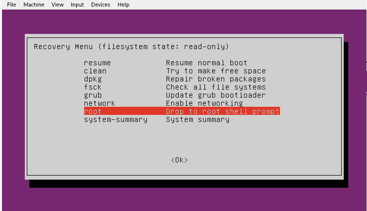

Di recovery menu ini, pilih bagian menu root. Maka akan langsung masuk sebagai root. Selanjut nya saya cek isi user pada mesin dengan cara ‘ls /home’, dan hasilnya terdapat 3 user yaitu ‘bambang’, ‘musaceous’, dan ‘ubuntu’.

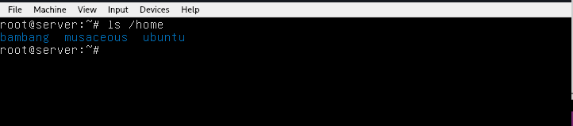

Selanjutnya saya mencoba ganti password dari salah satu user tersebut,awalnya mencoba mengannti user bambang, tetapi ketika login, user bambang ini tiba2 keluar lagi. Lalu saya mencoba user musaceous, tetapi tidak melakukan sudo. Akhirnya saya mencoba mengganti user ubuntu dengan cara ‘passwd ubuntu’.

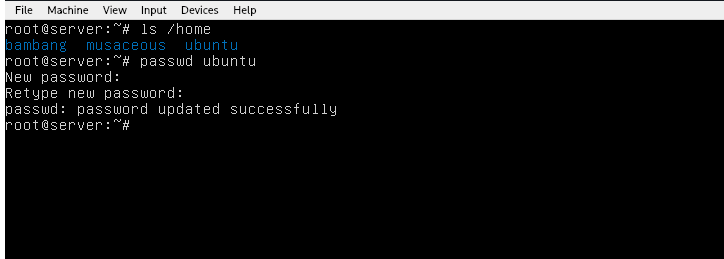

Setelah mengganti password, maka keluar dari user root dengan ketik ‘exit’ dan akan ditampilakn kembali recovery menu. Di recover menu pilih ‘resume’ dan klik ‘ok’.

Setelah itu masuk sebagai ubuntu, dan masukan password nya baru tadi

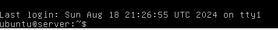

Setelah berhasil login, selanjutnya mencari flag pada server dengan menggunakan perintah find dan grep, seperti ‘find /\* | grep “flag.txt”

Perintah tersebut gunanya nyari file yang namanya "flag.txt" (dari perintah grep “flag.txt”) di SEMUA folder (karna pake /\*) di mesin ini. Karna mencari nya di semua folder, maka menggunakan sudo agar tetep bisa akses meskpun folder tersebut hanya bisa diakses oleh root / superuser.

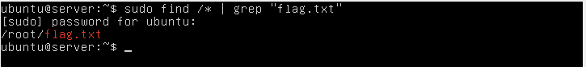

Dari hasil pencarian, terdapat sebuah flag di folder root ‘/root/flag.txt’. Jadi sebenarnya tadi bisa saja langsung akses melalui recover mode, cuman ntah kenapa yang saya lakukan ketika mencoba mengerjakan soal ini saya mencoba mencari nya dengan user terlebih dahulu.

Sekarang tinggal lihat isi flag nya dengan perintah ‘sudo /root/flag.txt’

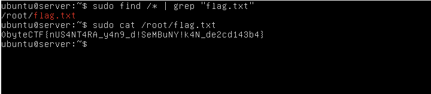

terdapat isi flag nya

flag:0byteCTF{nUS4NT4RA_y4n9_d!SeMBuNY!k4N_de2cd143b4}

#### Conclusion

Kesimpulan dari soal ini sebenarnya kita harus mencari terlebih dahulu network yg digunakan, celah apa yang ada di mesin ini, dan lainnya. Tetapi disini saya salah dengan cara menjawab soal ini, yang saya gunakan untuk menyelesaikan ini lebih tepatnya ketika mau mengganti password/lupa password os linux pada pc/laptop, sehingga mengganti dengan cara recover mode :(
